# Архитектура iOS-приложения Kufar — схемы

Всё в SwiftUI-модели: маршруты как data-only enum'ы, `navigationDestination` вместо реестра контроллеров, `Router` на таб.

Здесь — **решения и почему именно так**: границы модулей, компромиссы, что ломается в SwiftUI. Карта проекта целиком — репозитории, реестр, инструменты, CI — в отдельном документе: [architecture-overall.md](https://github.com/yklishevich/kufar-ios-demo/blob/main/architecture-overall.md). Схемы там сгенерированы из манифестов и не могут разойтись с кодом.

Демо-реализация: [kufar-ios](https://github.com/yklishevich/kufar-ios-demo/blob/main/README.md).

**О названиях.** Вертикаль товаров называется `Goods`, а не `Listings`: объявление — это вообще всё на площадке, и префикс `Listing*` занят общим каркасом карточки. Путаница в этом месте стоит дорого — через полгода никто не помнит, что где.

---

## 1. Карта модулей

### 1.1 Правило уровней

Вся схема держится на одном правиле, и его стоит показать отдельно от проводки — иначе оно тонет в стрелках.

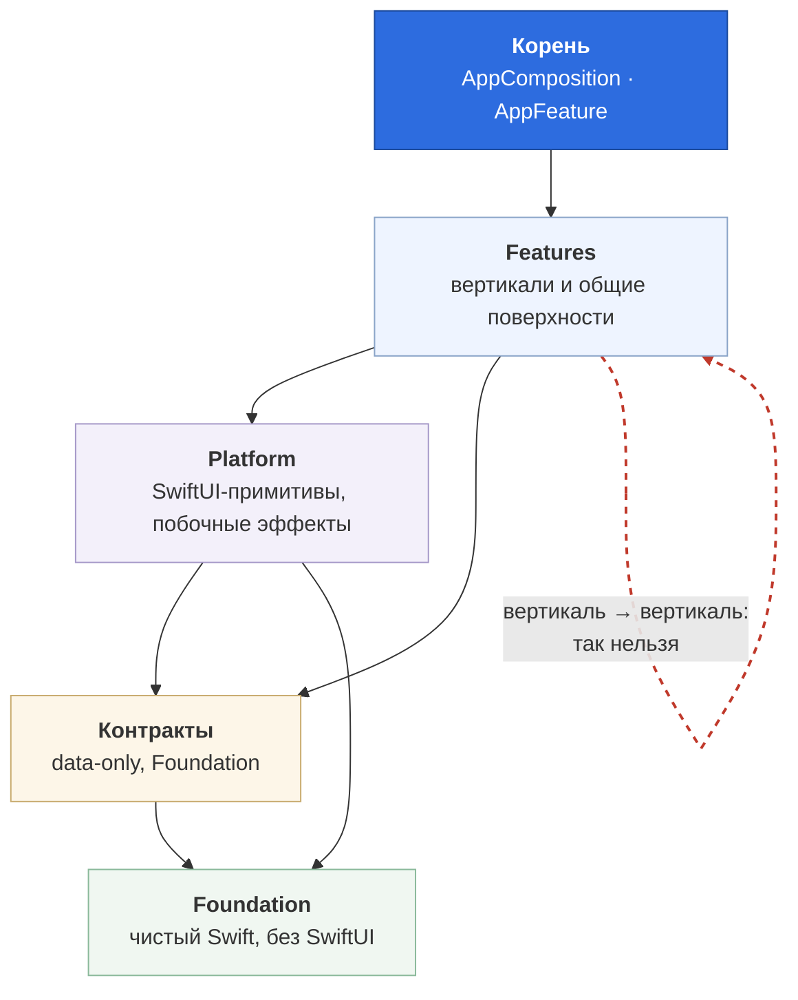

Правило из трёх частей, исключений нет:

1. модуль импортирует только то, что **ниже**;
2. модуль **не импортирует соседа** на своём уровне — красная петля;
3. нижний **никогда** не импортирует верхний.

Красная петля — единственное, что валит CI по существу. Остальные два пункта SwiftPM ловит сам: цикл в графе пакетов он просто не соберёт.

**Почему контракты отдельным уровнем, а не частью Foundation.** Контракт — это чужое публичное API, у него другой владелец и другой темп изменений. Правка в `SharedKernel` касается всех технически, правка в `GoodsInterface` — организационно.

### 1.2 Что на каком уровне

| Уровень | Модули | Признак |
|---|---|---|
| **Корень** | `AppComposition`, `AppFeature` | Знает состав сборки |
| **Features** | `Search`, `Posting`, `Goods`, `Auto`, `Profile`, `Auth` — последние два — продукты одного пакета `kufar.Identity` | Есть домен, маршруты и экраны |
| **Platform** | `Navigation`, `DesignTokens`, `DesignComponents`, `ListingKit`, `SchemaKit`, `AnalyticsImpl` | Есть SwiftUI или побочные эффекты, но нет домена |
| **Контракты** | `CatalogContracts`, `*Interface`, `SessionInterface`, `AnalyticsAPI` | Типы и протоколы; из реализаций — только тестовые двойники (`SpyTracker`, `*Testing`) |
| **Foundation** | `SharedKernel`, `NetworkingInterface`, `Networking` | Чистый Swift, ни строчки SwiftUI |

`RealEstate` и `Travel` дальше по тексту — гипотетические вертикали: на них показано, как схема расширяется, в коде демо их нет.

Единого `Core` нет намеренно: у сети, аналитики и дизайн-системы разный темп изменений и разные релизные циклы. Единица сборочного кеша — модуль, а не файл: внутри модуля Swift считает пофайлово, между модулями гранулярность схлопывается до модуля целиком. Поэтому один `Core` означал бы, что правка отступа в кнопке ставит под пересборку всех его потребителей, — а ими были бы все, от вертикалей до корня. Разделение не уменьшает работу компилятора, оно уменьшает, кого эта работа касается.

То же и с версиями: один `Core` — одна версия на сеть, аналитику, навигацию и дизайн-систему, и мажор ради смены HTTP-клиента заставлял бы мигрировать тех, кому нужны были только токены.

А вот про владение здесь стоит сказать ровно то, что есть: у всех платформенных пакетов владелец сегодня один, и разделять владение пакетная граница не требуется — CODEOWNERS работает по путям, а не по манифестам. Что даёт пакет, так это возможность переселения: идентичность в реестре — `kufar.DesignTokens`, а не адрес, поэтому переезд дизайн-системы к своей команде не изменит ни одного манифеста потребителя. Кусок сплошного `Core` так не отдать — его пришлось бы сначала разрезать, а это ломающее изменение для всех.

**`Search` и `Posting` — не вертикали, а общие поверхности,** и это самый важный узел схемы. Лента на классифайде одна: пользователь ищет «пылесос» и «Golf» в одном поле, а подаёт объявление в одну и ту же форму — вертикаль выбирается **категорией**. Значит ни лента, ни подача не могут принадлежать ни `Goods`, ни `Auto`: у каждой свой владелец, и обе знают **контракты** всех вертикалей, но ни одной реализации. Объединяет их не «поперечность», а то, что **вертикаль определяется внутри флоу, а не до него** — и владеть флоу, который начинается раньше, чем известна вертикаль, некому. Подробно — 4.1.

**`ListingKit` — не второй `Core`.** Это узкий модуль с одной ответственностью: каркас карточки объявления. Он не знает ни одной вертикали: в его манифесте нет ни одного `*Interface`, а импорт без записи в манифесте не пропустит линтер. Подробно — раздел 5.

### 1.3 Одна вертикаль в разрезе

Остальные устроены симметрично, поэтому рисовать их все смысла нет — в полном виде схема перестаёт читаться.

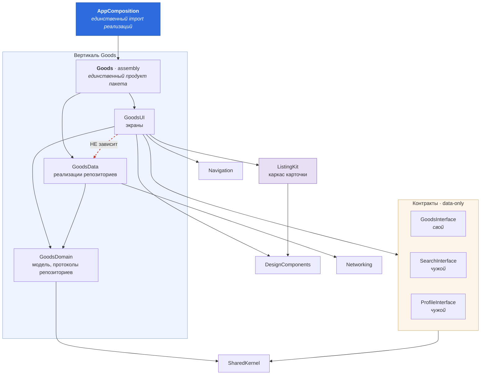

**Три вещи, ради которых эта схема нужна.**

*Наружу торчит один продукт.* `GoodsUI`, `GoodsData` и `GoodsDomain` продуктами не объявлены — импортировать их извне не даст SwiftPM. Правило перестаёт быть договорённостью.

*И три уровня видимости вместо одного.* Манифест закрывает границу пакета, но внутри пакета таргеты — тоже отдельные модули, и `public` там означает не «наружу», а всего лишь «в соседний таргет». Рефлекс пометить `public` всё подряд приводит к тому, что в исходнике написано ровно обратное намерению. Уровни расставлены по фактическому использованию:

| Уровень | Что | Пример |
|---|---|---|
| `public` | стоит в сигнатуре ассамблеи, то есть видно корню | `GoodsRepository`, `GoodsListing` |
| `package` | пересекает границу таргета внутри пакета | `GoodsDestinations`, `RemoteGoodsRepository` |
| без модификатора | видит только собственный `*Destinations` | `GoodsDetailScreen`, `PostingFormScreen`, `SettingsScreen` |

Уровень `package` появился в Swift 5.9 (SE-0386) ровно под этот случай, и SwiftPM включает его сам. Ни один экран вертикали больше не `public`: наружу торчат протокол репозитория и его модель, всё остальное — внутренности. Это то же правило, что «один продукт на пакет», но выраженное в языке, а не в манифесте, — то есть проверяемое компилятором, а не линтером.

*Чужие вертикали видны только через контракты.* `SearchInterface` нужен кнопке «другие объявления продавца», `ProfileInterface` — переходу в профиль. Оба лежат **ниже** уровня вертикалей, поэтому горизонтальной зависимости нет.

*`GoodsUI` не зависит от `GoodsData`.* Красная стрелка — инверсия зависимостей: экраны знают протокол репозитория из домена, а реализацию получают из корня.

**Критерий проверки всей схемы:** каждая вертикаль собирается и запускается в отдельном демо-приложении без остальных. Не запускается — протекла горизонтальная зависимость. В этом демо отдельных приложений на вертикаль нет — утечку ловят манифесты и `BoundaryTests.testVerticalsDoNotSeeEachOther`; критерий остаётся требованием к рабочему проекту.

### 1.4 Чем пакеты адресуют друг друга

Схема выше говорит, *что* от чего зависит. Отдельный вопрос — *как* зависимость находится, и он определяет больше, чем кажется.

**Пакеты подключены через реестр (SE-0292), а не по гит-URL.** В манифесте стоит имя:

```swift
.package(id: "kufar.GoodsContracts", from: "1.0.0")
```

Разница не косметическая. С гит-зависимостями **identity пакета — это его адрес**, и отсюда тянется цепочка следствий: URL указывает на репозиторий → `Package.swift` ищется в корне → версия это тег → тег принадлежит репозиторию целиком → **один пакет на репозиторий**. Двадцать один пакет автоматически означает двадцать один репозиторий, то есть структуру диктует инструмент.

В реестре identity — **имя**. Где лежат исходники, знает реестр, и может это изменить, не тронув ни один манифест потребителя. Три следствия:

- несколько пакетов могут жить в одном репозитории и релизиться независимо;
- переезд пакета между репозиториями невидим для потребителей — а это ровно то, что происходит при реорганизации команд;
- упаковка в репозитории становится **решением** про границы владения, а не следствием ограничения SwiftPM.

**Локальная разработка при этом не меняется.** Xcode подменяет зависимость папкой из воркспейса — правка в `kufar.Foundation` видна в `kufar.Goods` сразу, без публикации версии. Подмена сопоставляет зависимость с папкой по identity, и вот здесь есть правило, которого нет в документации:

> **Имя папки обязано совпадать с идентичностью в реестре: `kufar.Foundation`.**

Имя репозитория при этом не значит ничего: `bootstrap.sh` клонирует `kufar-platform.git` в папку `platform_team`, а подмена смотрит на имена папок **пакетов** внутри неё. Отступление от формата Xcode не прощает:

```
unable to override package 'Foundation' because its identity 'kufar.foundation'
doesn't match override's identity (directory name) 'foundation'
```

Правило найдено экспериментом, и путь к нему стоит привести целиком: он показывает цену неполной проверки. Сначала CLI ответил категорично:

```
error: registry dependency 'kufar.Toolbox' can't be edited
```

Из чего следовал вывод: локальная подмена с реестром несовместима, мигрировать нельзя. **Неверный.** `swift package edit` и подмена в воркспейсе — разные механизмы, и Xcode дал другую ошибку, ту, что выше: подмена работает, не совпадала только идентичность. Остановись проверка на первом результате — решение было бы противоположным и обоснованным ложно.

**Цена, которую за это платим.** Публикация версии стала своей работой: собрать архив, посчитать контрольную сумму, загрузить, зарегистрировать — это делает `Tools/publish.sh --push --tag`, но делает потому, что кто-то написал. Реестр нужно где-то держать: публичного хостинга для Swift нет, [реализация лежит в `registry/`](https://github.com/yklishevich/kufar-ios-demo/blob/main/registry/README.md) — Cloudflare Workers, R2 под архивы, D1 под метаданные. И у реестровых зависимостей нет веток: `.package(url:branch:)` для отладки чужого пакета не сделаешь, только версии.

**Что из этого сделано.** Пакеты сведены в **шесть репозиториев по числу команд** — `kufar-platform`, `kufar-search`, `kufar-goods`, `kufar-auto`, `kufar-posting`, `kufar-identity`. Папка команды сама стала репозиторием, раскладка на диске не изменилась: `.git` переехал на уровень выше, а воркспейс и манифесты переезда не заметили.

Выигрыш конкретный. Границы владения совпали с границами репозиториев, поэтому `CODEOWNERS` стал одним файлом на репозиторий вместо двадцати одного — с разделением по путям там, где в репозитории есть контрактный пакет. Правка контракта вместе с реализацией — `kufar.GoodsContracts` и `kufar.Goods` лежат рядом — теперь **один коммит вместо двух PR с тегом между ними**, а таких изменений на порядок больше, чем кросс-командных. Конфигураций CI стало шесть вместо двадцати одной, а после выноса общего тела в переиспользуемый workflow — одна на всех плюс шесть тонких вызовов-обёрток.

Версии остались независимыми: тег несёт имя пакета — `kufar.Foundation-1.2.0`. Голая `1.2.0` в общем репозитории означала бы, что соседний пакет свою `1.2.0` выпустить уже не может.

**Цена переезда, названная честно.** Переносит коммиты `git subtree`, но SHA при этом меняются — ссылки на коммиты в старых задачах протухают. PR, ревью и обсуждения он не переносит вовсе: они остаются в старых репозиториях. Отсюда правило для рабочего проекта — старые репозитории **архивировать, а не удалять**: это стоит ноль и сохраняет половину контекста, ради которого история и нужна.

В этом демо старые репозитории удалены, а история сведена к одному коммиту на репозиторий. Причина в том, что сохранять было нечего: пара коммитов на пакет и ни одного PR — то есть ровно того, что `subtree` не переносит, там и не было. В рабочем проекте ответ был бы обратным.

**Чего это не решает.** Добавление вертикали дороже не стало: `SharedKernel` в платформенном репозитории, а его потребители — в поисковом и подачном, значит фазовый переход из 2.3 никуда не делся. Убрал бы его только полный монорепозиторий, но он требует выборочной сборки и кеша артефактов — на десятке разработчиков это больше инструментов, чем выигрыша.

---

## 2. Контракт и реализация

Одна идея на трёх масштабах.

### 2.1 Между пакетами

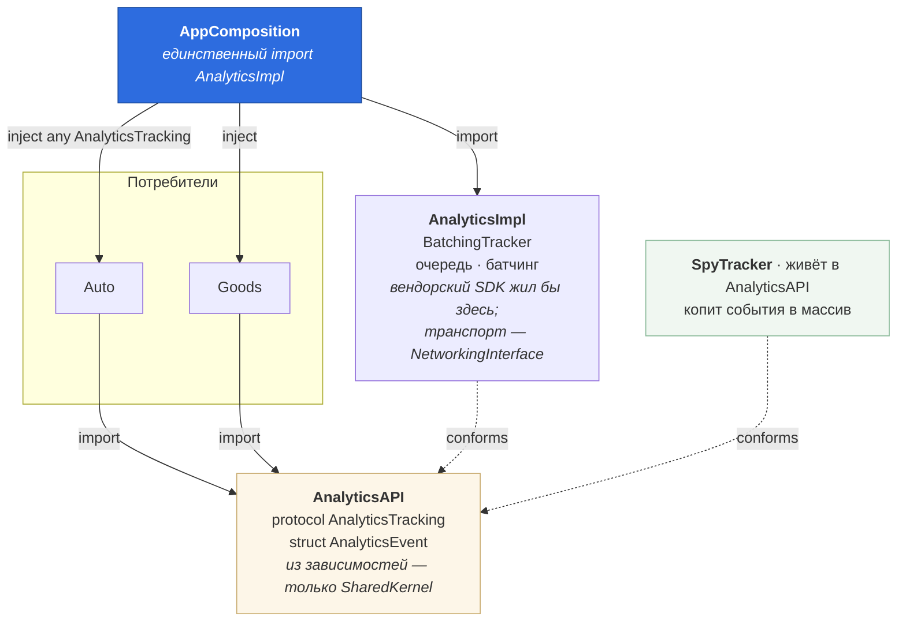

Вендорский SDK не линкуется ни в одну вертикаль: продукт `AnalyticsImpl` объявляет только композиционный корень. Точная граница здесь важна — разделение на продукты разводит линковку, но не резолв: зависимости объявляются на уровне пакета, поэтому версии SDK всё равно участвовали бы в разрешении графа у всех, кто подключил `kufar.Analytics` ради одного протокола. Когда SDK появится, это и станет поводом развести API и реализацию по разным пакетам.

В демо место вендора занимает `BatchingTracker` поверх `HTTPPerforming`; замена на Amplitude переписывает один класс, сигнатуры проверит компилятор.

`any AnalyticsTracking` здесь бесплатен: у протокола нет ассоциированных типов. Это важное различение — `any` для сервисов уместен, `any View` не рендерится вообще (см. раздел 6).

### 2.2 Кому принадлежит протокол

Самый неочевидный момент — и лучший вопрос, который стоит задать вслух самому.

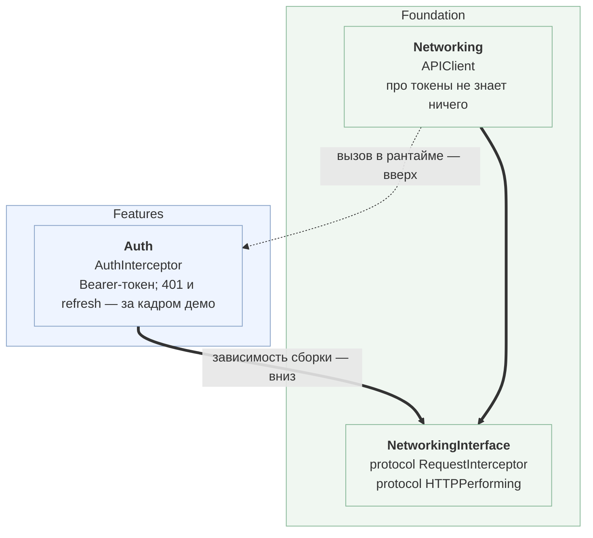

> Протокол принадлежит не тому, кто его реализует, а тому, кто его использует.

Положи `RequestInterceptor` в `Auth` — и `Networking` придётся импортировать аутентификацию: стрелка вверх, цикл. Практическое следствие: пакет с протоколом кладут на уровень **самого нижнего потребителя**.

Обрати внимание, что `Auth` здесь — **фича**, а не платформа: у неё есть маршруты, экраны логина и своя доменная логика вокруг токена. Тем сильнее пример: протокол объявлен на самом дне графа, реализован на самом верху, и `Networking` про аутентификацию по-прежнему не знает ничего.

Правило определяет **пакет**, а деление на таргеты внутри него отвечает на другой вопрос — абстракция против реализации. Поэтому оба протокола лежат в `NetworkingInterface`, а `APIClient` в `Networking`: реализующему `RequestInterceptor` нужен контракт, а не клиент вместе с ним. Тот же довод, по которому `SessionInterface` вынесен из `Auth`.

В этом таргете лежат два протокола, и правило владения у них **одинаковое** — оба объявлены потребителем. Но инверсия из них только одна:

| | потребитель | реализует | поток управления |
|---|---|---|---|
| `RequestInterceptor` | `APIClient`, на дне | `Auth`, наверху | снизу вверх — **против** графа |
| `HTTPPerforming` | пять `*Data` и `AnalyticsImpl`, наверху | `APIClient`, на дне | сверху вниз — по графу |

Разница не во владении, а в том, где стоит реализующий относительно вызывающего. У `RequestInterceptor` вызов идёт против зависимости сборки — это и есть инверсия по определению. У `HTTPPerforming` вызов и зависимость сонаправлены: инверсии нет, есть подменяемость и тестируемый адаптер.

Путать эти два случая легко, и именно на этом возникает спор «это DIP или обычная точка расширения». Владение здесь ничего не решает — решает направление вызова.

Проверяется линтером: `import Networking` разрешён единственному таргету — `AppComposition`. Всё остальное работает с контрактом.

Почему на классифайде это особенно важно: лента гостю, поиск и просмотр объявления работают до логина. `Networking`, который умеет только авторизованные запросы, нельзя переиспользовать для большей части трафика.

### 2.3 Внутри вертикали

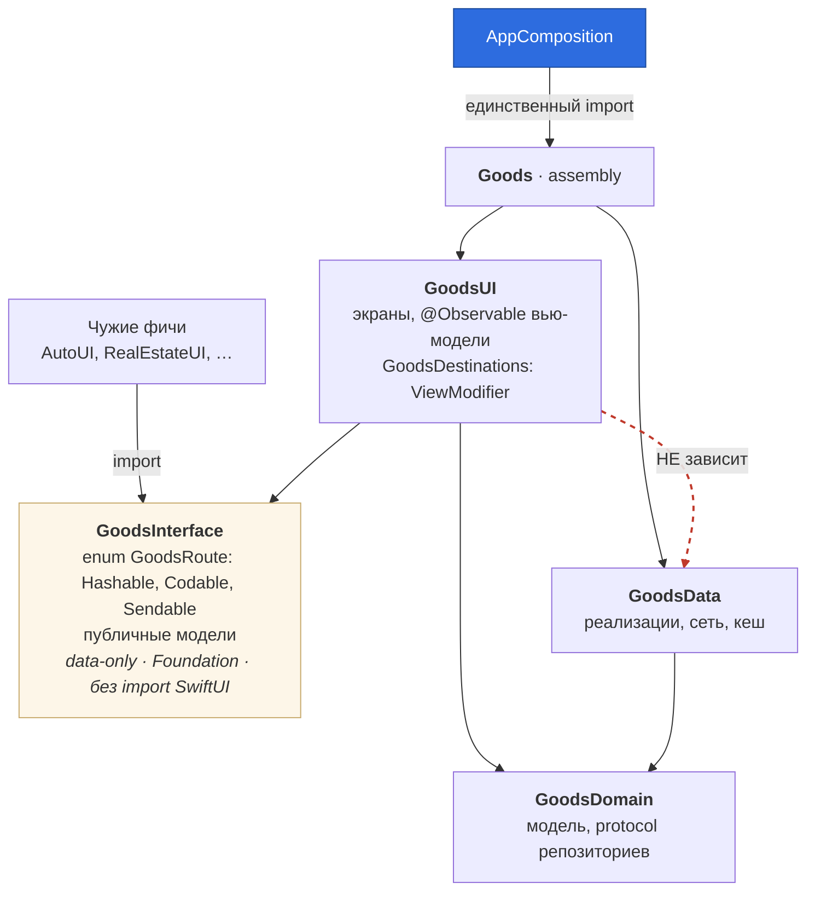

**Почему интерфейс обязан быть Foundation-only.** Три следствия, все практические: превью и тесты не тянут SwiftUI-граф; `Codable` бесплатно даёт восстановление `NavigationPath`; чужая фича не пересобирается от правки вёрстки. `import SwiftUI` в `*Interface` — пункт чек-листа на ревью.

**Что произойдёт при добавлении вертикали.** По существу это вопрос про открытость enum'ов в контрактах, и решается она **один раз, при создании типа**. Добавить кейс в публичный `enum` — ломающее изменение для всех, кто матчит его исчерпывающим `switch`. Ветку `default` задним числом не поставить дёшево: это правка во всех потребляющих репозиториях, то есть ровно та работа, которой избегали. Критерий один — **кто делает `switch`**:

| Enum | Кто матчит | Режим |
|---|---|---|
| `*Route` | только свой `*Destinations` | закрытый, ломает одного владельца |
| `Vertical` | лента, избранное, подача, резолв диплинка | закрытый, ломает три команды — и это механизм |
| `FieldKind` | рендерер схем | открытый, `.unknown` обязателен |

`*Route` безопасен не благодаря дисциплине, а благодаря разрезу модулей: чужие вертикали маршруты только **конструируют и пушат**, но не матчат. Поэтому новый кейс в `GoodsRoute` ломает один файл в том же репозитории у того же владельца.

`Vertical` — единственное место, где поломка сборки задумана. Добавили `realEstate` — компилятор останавливает восемь точек у трёх команд, от ленты и избранного до фикстур поиска, и за большинством из них продуктовое решение: какой маршрут пушить из ленты, как рисовать сохранённую карточку в избранном, куда вести после публикации, какой шаг подставить в форму подачи, что делать с диплинком без категории. `default` превратил бы это в тихое «тап ничего не делает», причём только для новой вертикали — то есть там, где ещё никто не тестирует. Компилятор выдаёт исчерпывающий чек-лист; человек с грепом составит его с пропусками, и первым выпадет `FavoritesScreen`.

Цена у решения есть: `Vertical` живёт в `SharedKernel`, значит новая вертикаль — это согласованные PR в три чужих репозитория. Дорого. Но эти PR понадобятся в любом случае, вопрос только в том, обнаружатся они на сборке или в отзывах в App Store. И вертикали добавляют раз в год, а не раз в спринт.

#### Как это мержится — валидного порядка нет

Следующий вопрос обычно такой, и он бьёт точнее предыдущего: **в каком порядке мержить?** Ответ — ни в каком:

- смержил `SharedKernel` первым → у трёх команд `switch` перестал быть исчерпывающим, их main красный;
- смержил потребителей первыми → они ссылаются на `.realEstate`, которого ещё нет.

Любое промежуточное состояние нецелостно. Это прямая цена связки «закрытый enum в общем ядре + мультирепозиторий»: то, что в монорепозитории один атомарный коммит, здесь распадается на четыре.

**Решение — expand and contract, применённый к enum.** Четыре фазы, каждая мержится независимо и оставляет main зелёным:

| Фаза | Что мержится | Состояние |
|---|---|---|
| 1 | потребители добавляют `default` с осознанным фолбэком | поведение не изменилось, кейсов новых нет |
| 2 | `.realEstate` в `SharedKernel` | компилируется у всех, вертикаль деградирует явно |
| 3 | каждый потребитель пишет свою ветку, своим темпом | никто никого не блокирует |
| 4 | `default` убираются | исчерпывающность восстановлена |

Фолбэк на первой фазе пишет сама команда и осмысленно: лента скрывает результат, резолв диплинка уходит в веб-фолбэк (3.2), подача не предлагает категорию. Это принципиально не то же самое, что `default` в стационарном состоянии: здесь он **временная конструкция миграции**, живущая ровно до четвёртой фазы.

**Что дают версии.** В версионном режиме задача распадается иначе: добавление кейса — ломающее изменение, значит `kufar.Foundation` 2.0.0, а потребители остаются на `from: "1.0.0"` и мигрируют когда захотят. Никто не заблокирован. Цена — HEAD-сборка воркспейса красная всё время миграции: main ядра уже 2.0, main потребителей ещё 1.x. Поэтому фазовый подход лучше: он держит зелёными оба режима сразу.

**И развилка, которую стоит назвать вслух.** У проблемы есть структурное решение — не держать `Vertical` закрытым enum'ом, а сделать его `struct` со статическими константами, как `Notification.Name`. Тогда добавление не ломает никого и миграция не нужна. Но исчезает то, ради чего он закрытый:

| | Закрытый `enum` | Открытый тип |
|---|---|---|
| Полноту обработки гарантирует | компилятор | люди на ревью |
| Добавление вертикали | четыре согласованных PR | одна строка |
| Пропущенную ветку находит | билд-сервер | пользователь |

Выбрано первое, потому что вертикаль добавляют раз в год, а забытая ветка живёт в продакшене месяцами. Но это выбор, а не единственно верный вариант.

**Самое честное:** в монорепозитории этой проблемы нет вообще — один коммит, атомарно, всегда зелёный. Добавление вертикали ровно та операция, где монорепозиторий объективно выигрывает. Мультирепозиторий выбран за другое — независимые релизные циклы, `CODEOWNERS` по границам репозиториев, невозможность случайно импортировать чужое, — и атомарные кросс-командные изменения это цена, которую за это платят по заранее известному сценарию.

`FieldKind` — противоположный режим: кейсы приходят с бэкенда, клиент обязан пережить поле из будущей версии схемы (4.2). Там `default` не компромисс, а требование.

**Из той же серии — конформансы.** `Hashable` нужен, чтобы маршрут лёг в `NavigationPath`; `Codable` — чтобы путь пережил выгрузку приложения; `Sendable` — чтобы значение пересекало границы акторов. Для `public` типов `Sendable` не выводится, его пишут явно, и ставить его надо превентивно: потребитель не может добавить его себе, ему остаётся `@retroactive @unchecked` — то есть заявление за чужой модуль. Всё, что чинится только у владельца, в мультирепозитории закладывают заранее.

**Тест на фичу:** удали её из composition root. Собралось — это фича. Не собралось — это shared-сервис с прикрученным экраном, его надо вынести уровнем ниже.

**Где не надо.** Симметрию ради красоты графа не насаждать: если у модуля нет доменной логики и сети — не плодить `Domain`/`Data` пустышками. Протокол оправдан, когда реализация тянет тяжёлые зависимости, может быть заменена, нужна в моках или принадлежит другой команде. Для `struct Money` — лишний слой.

**Красный флаг из той же серии:** `import AuthInterface` внутри таба ради текущего пользователя. Это не Auth, это сессия — `SessionInterface`. Из того, что все зависят от авторизации, не следует, что все зависят от фичи `Auth`.

---

## 3. Навигация

### 3.1 Переход в чужую вертикаль

В карточке объявления есть «Профиль продавца». Экран профиля — в чужом модуле.

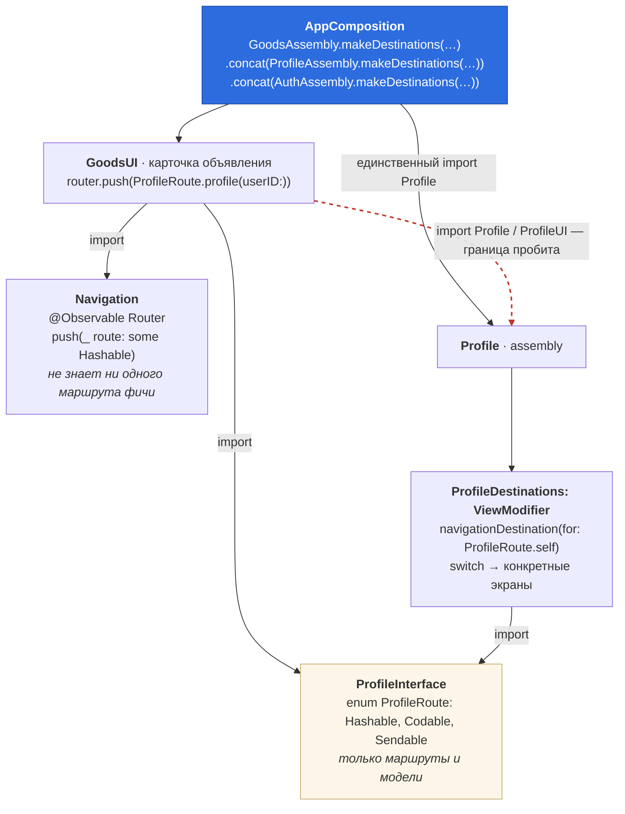

**Суть.** `Goods` знает, *куда* идти, но не знает, *что* нарисуется. `NavigationPath` принимает любой `Hashable`, поэтому `Router` тоже не знает ни одного конкретного маршрута — он общий примитив на пару десятков строк.

`ViewModifier`, а не фабрика, возвращающая `AnyView`, — решение намеренное: `navigationDestination` строит ветки статически, `switch` даёт `_ConditionalContent`, type identity сохраняется, стирания нет нигде. Модификаторы фич склеиваются через `.concat(...)` в `ModifiedContent<A, B>`, который сам `ViewModifier`; добавилась вертикаль — ещё один `.concat`.

**Дефолтный аргумент в `init` — дыра в DI.** `init(repo: = RemoteGoodsRepository(client: .live))` заставляет фичу знать продовый эндпоинт, а в превью даёт живую сеть при забытом аргументе. Репозиторий приходит из корня — тогда же `APIClient` становится один на приложение: общий пул соединений, один интерсептор с токеном.

Правило не абсолютное, и границу лучше провести самому: запрещён дефолт, **прячущий зависимость с побочными эффектами**. Нейтральный дефолт допустим — `rowAccessory: ListingRowAccessory = .none` в экранах поиска не тянет ни сети, ни продового адреса: забыл аргумент — получил ленту без акцессоров, а не живой трафик в превью. Признак простой: если при забытом аргументе что-то пойдёт в сеть, на диск или в аналитику — дефолта быть не должно. В ассамблее того же слота дефолта уже нет: состав вертикалей знает только корень.

**Чем это отличается от реестра маршрутов на UIKit.** Там был общий `enum Route` и словарь обработчиков, заполняемый в рантайме: стрелки на уровне сборки нет вообще, но и проверки компилятором нет — `router.open(.chat(...))` соберётся без обработчика. Здесь стрелка есть, но идёт в `*Interface` — data-only пакет уровнем ниже вертикалей, а не в реализацию. Компилятор проверяет и существование маршрута, и типы его параметров. Цена — `navigationDestination` всё равно резолвится в рантайме по типу, так что забытый `.concat` даёт «тап ничего не делает». Это ловится хост-тестом: поднять `RootView` с полной цепочкой destinations, пройтись по всем кейсам каждого `*Route` и проверить, что экран построился. Один тест на приложение возвращает утраченную гарантию. В демо его нет: `RouteCodableTests` обходит те же `allCases`, но проверяет только выживание пути в `Codable` — забытый `.concat` он не поймает.

**Второе отличие в плюс:** общий `enum Route` — пакет, от которого зависят все, и добавление маршрута трогает всех. Здесь добавление маршрута в `TravelInterface` пересобирает только тех, кто в него ходит.

### 3.2 Внешний вход и сборки разного состава

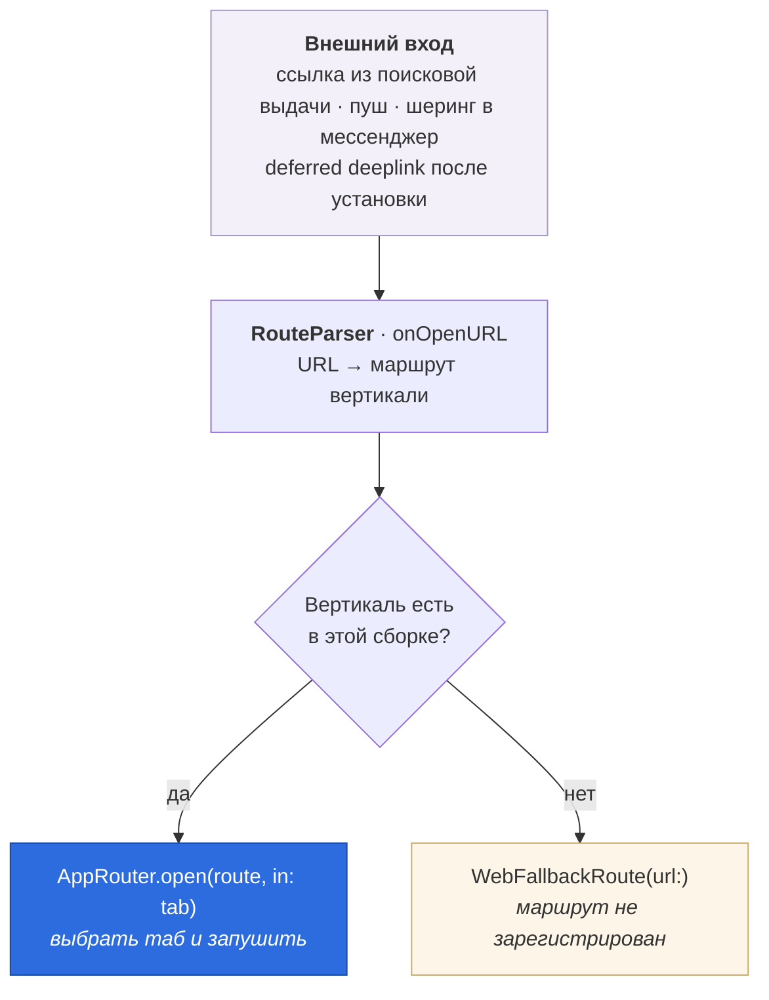

Внешняя ссылка и внутренний переход упираются в один механизм. Для классифайда это критично: трафик из поисковой выдачи, пушей и шеринга фактически второй главный вход в приложение.

Побочный эффект — сборки с разным составом модулей. Если `Travel` не входит во флейвор, его destinations не подмешаны в цепочку. Без явной проверки это тихое «ничего не произошло»; с проверкой — веб-фолбэк. Composition root отдаёт парсеру список доступных вертикалей, потому что только он знает состав сборки.

Отдельный случай — ссылка на объявление без указания вертикали. Разобран в 5.3.

### 3.3 Роутер на таб

Один `Router` на приложение — самая частая ошибка в табах: push из первого таба уезжает во второй.

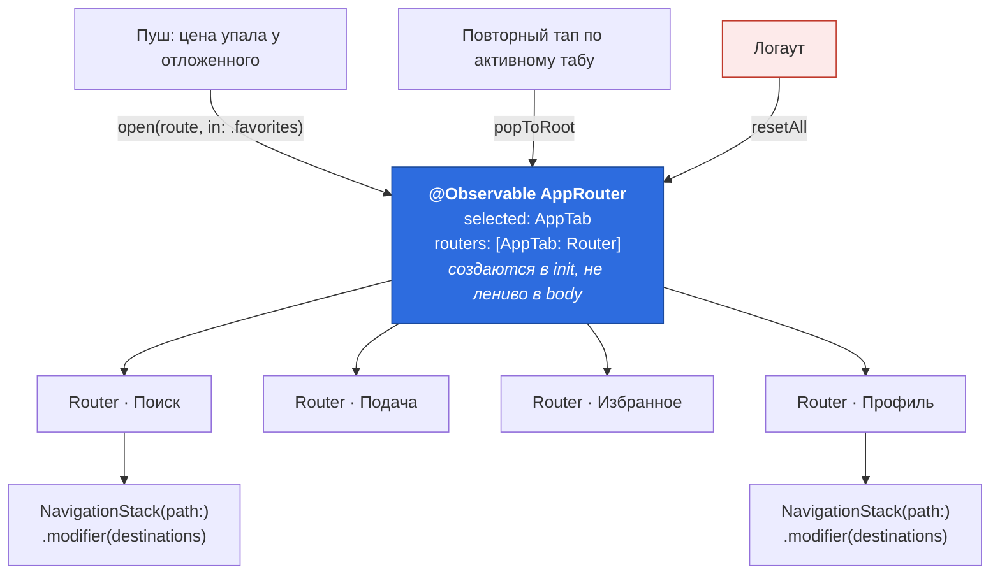

Пять вещей, которые легко сделать неправильно:

- **Вкладки не отражают вертикали.** Табы — это режимы работы пользователя: искать, подать объявление, вернуться к отложенному, управлять своим. Вертикаль живёт внутри поиска как категория фильтра (4.1). Сделать вкладку на вертикаль — значит привязать корневой экран к каталогу и получать PR в репозиторий команды приложения на каждое новое направление.
- **Ленивое создание роутеров в `body`** — «Modifying state during view update». Все создаются заранее в `init`.
- **Destinations применяются во всех табах.** Из ленты тапнул продавца → профиль пушится внутри таба «Поиск». Так работают все нативные приложения; переключать таб по тапу противоестественно. Один экран в двух стеках одновременно — нормально, у них разные модели.
- **`resetAll()` при логауте — не косметика.** Иначе следующий пользователь увидит стек предыдущего, включая экраны с его данными. Восстановление стека до логина — тот же класс проблемы.
- **Третьим табом не должен быть Auth.** Логин — состояние приложения, а не вкладка. Кнопка «Выйти» в профиле дёргает `SessionStore` из `SessionInterface`; именно тут обычно тянут `import Auth` и рушат схему.

**Про `@Observable` vs `ObservableObject`.** Второй перерисовывает всех подписчиков на каждое изменение `path`. На iOS 17+ первый: экраны, читающие роутер, но не путь, перестают дёргаться.

**Про восстановление состояния.** `NavigationPath.codable` возвращает `nil`, если хотя бы один элемент стека не `Codable` — молча, для всего пути. Ещё одна причина держать в `*Interface` голые enum'ы. Практический минимум — сохранять только выбранный таб: одна строка `@SceneStorage`, ноль рисков, 80% ценности. Полный путь добавлять под конкретный сценарий, а не «на всякий случай»: `CodableRepresentation` пишет полные имена типов, поэтому переименование таргета ломает декодирование и нужна явная версия снапшота.

---

## 4. Лента и фильтры

### 4.1 Лента одна, вертикаль — это категория

Соблазн сделать вертикаль вкладкой велик и неверен. На классифайде лента одна: пользователь вбивает «пылесос» и «Golf» в одно и то же поле, а вертикаль выбирается **категорией внутри фильтра**. Отсюда всё остальное.

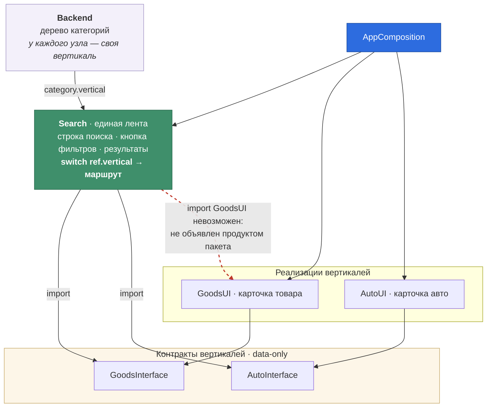

**Три следствия.**

*Вертикаль приезжает данными.* Каждый результат выдачи несёт `vertical` — бэкенд знает, что вернул. Клиент не вычисляет вертикаль по категории и не хардкодит соответствие.

*В ленте про все вертикали знает ровно одно место* — переход из выдачи:

```swift
switch ref.vertical {
case .goods: router.push(GoodsRoute.details(ref.id))
case .auto:  router.push(AutoRoute.details(ref.id))
}
```

Ни одного импорта чужой реализации — только контракты. Добавится вертикаль, компилятор приведёт сюда сам.

*Добавление вертикали не трогает таб-бар.* Оно трогает дерево категорий на бэкенде и этот `switch`. Если бы вертикали были вкладками, каждая новая означала бы правку корневого экрана — то есть PR в репозиторий команды приложения на каждый запуск нового направления.

**Кому принадлежит лента.** Отдельной команде поиска — и это ответ сразу и на организационный вопрос: лента, фильтры, избранное и сохранённые поиски — общие поверхности, у них свои метрики и свой владелец. Вертикали владеют карточкой и доменом.

**Следующий вопрос обычно про строку: «а если у авто в ленте нужен пробег, а у квартиры — этаж?»** Строка одна на все вертикали, и иначе быть не может: `Content` у `ForEach` один на всю коллекцию, значит тип ячейки обязан совпадать. Различие приезжает **слотом**, а слот собирает composition root — единственный модуль, которому позволено назвать все реализации:

```swift
// AppComposition
let rowAccessory = ListingRowAccessory { ref in
    switch ref.vertical {
    case .goods: GoodsAssembly.rowAccessory(for: ref)
    case .auto:  AutoAssembly.rowAccessory(for: ref)
    }
}
```

`switch` внутри `@ViewBuilder` даёт `_ConditionalContent`, то есть конкретный тип. `AnyView` появляется на уровень глубже, внутри `ListingRowAccessory`, и только вокруг акцессорной строки: контейнер, миниатюра, цена, бейдж, свайпы и `@State` ячейки сохраняют identity. Это правило из раздела 6 — опускай коробку как можно глубже — применённое буквально.

**Почему здесь стирание, хотя в карточке и в подаче его нет.** Дженерик работал бы и тут — значит это выбор, а не необходимость, и объяснять его надо честно. Критериев два, и работают они на разных этапах:

*Стоимость протаскивания* говорит, когда стирание **соблазнительно**. В карточке — никогда: слот заполняет сама вертикаль, тип связывается в одной точке. В подаче — слегка: одна точка входа, и дженерик прячется за `some ViewModifier`. В ленте — заметно: строка нужна в стеке и в двух табах, параметр протёк бы в три сигнатуры ассамблеи ради одного значения.

*Наличие состояния* говорит, когда оно **допустимо**. `AnyView` бьёт по identity, а identity важна там, где есть что терять. В акцессоре ленты — `Label`, посчитанный из цены: ни `@State`, ни анимации, ни картинки. В `VINReportCard` — раскрытая секция, в шаге подачи — введённый VIN и флаг загрузки; стереть их значит терять пользовательский ввод.

Стирать можно там, где сошлось и то и другое. Сошлось ровно в одном месте из трёх — и это не исключение из принципа, а сам принцип, сформулированный точнее: **стирай там, где нечего терять, и держи наготове признак, по которому это перестанет быть правдой.** Признак записан прямо в `ListingRowAccessory`: появился `@State` внутри акцессора — коробку снимают и переходят на дженерик.

Сказать это самому полезнее, чем делать вид, что `AnyView` не встречается нигде.

### Подача — то же самое, но наоборот

Второй модуль с такой же позицией в графе — подача объявления.

Соблазн описать пару как «поиск читает поперёк вертикалей, подача пишет в одну» велик, но формулировка слабая и напрашивается на встречный вопрос: если подача всегда про одну вертикаль, почему она не внутри вертикали? Выдача поиска действительно гетерогенна — в одном списке лежат пылесос и Golf. Черновик подачи гомогенен: одна категория, одна вертикаль, всегда.

**Общее у них другое: вертикаль определяется внутри флоу, а не до него.** На входе в поиск запрос ещё пустой, на входе в подачу категория ещё не выбрана — `PostingDraft` создаётся с `categoryID: nil`. Вертикаль в обоих случаях **результат** флоу, а не его предусловие: пользователь знает, что ищет пылесос, а приложение узнаёт это только из ответа выдачи.

Отсюда следует, что владельца среди вертикалей нет — и это невозможность, а не неудобство. Разберём на подаче.

Экран выбора категории показывает категории всех вертикалей сразу, поэтому лежать он может только в одной из них. Допустим, отдали его товарам. Технически `Goods` тут же начинает импортировать `AutoInterface`, `RealEstateInterface` и все остальные, а `Auto` ради кнопки «Подать объявление» — импортировать `Goods`. Горизонтальная петля со схемы 1.1, причём сразу ко всем.

Организационно хуже. Команде авто нужен шаг со сканированием VIN — код подачи в чужом репозитории, значит PR в товары, ревью от людей, которые в её домене не разбираются, и релиз в чужом цикле. Одна вертикаль становится **шлюзом для всех остальных**: авто ждёт, товары превращаются в бутылочное горлышко и тратят время на чужие задачи.

Поделить флоу между вертикалями тоже нельзя: первый экран один, и на нём вертикаль ещё неизвестна. Он принадлежит всем сразу, а «всем сразу» в модульной схеме не бывает — у модуля ровно один владелец.

Тот же аргумент дословно работает для ленты. **Общее правило: если у кода нет естественного владельца среди существующих команд, ему нужен собственный** — иначе назначенный владелец становится привратником.

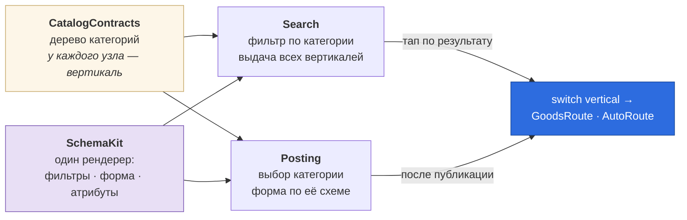

Что из этого следует:

**Точек схождения две, и обе не принадлежат вертикалям.** Пока такое место одно, оно выглядит случайностью; когда их две и устроены они одинаково — виден приём. Добавится вертикаль — компилятор пройдёт по `switch` обоих модулей, а они и так знают про все вертикали.

**Одна схема обслуживает три поверхности.** Поля категории «Легковые» — это и фильтры в поиске, и вопросы при подаче, и блок атрибутов в карточке. Разница только в режиме: `SchemaForm` редактирует, `SchemaSection` показывает. Новая категория не требует релиза ни на одной из трёх.

**Отдельный владелец у подачи — не про размер кода, а про метрику.** Команда подачи отвечает за completion rate воронки и время до публикации, то есть напрямую двигает ликвидность площадки. Отдай подачу поиску — и у одного владельца окажутся две конкурирующие метрики.

**Черновик — часть контракта, а не деталь реализации.** `PostingDraft` объявлен `Codable` в контрактном пакете, потому что переживает выгрузку приложения из памяти. Подача — самое конверсионное место продукта: потерянный на третьем шаге черновик это несозданное объявление.

**Где схема кончается и начинается код.** Схема честно покрывает подачу ровно до тех пор, пока различие между вертикалями сводится к **набору вопросов**. Но подача авто — это разбор VIN, справочник марка → модель → поколение, распознавание номера камерой; подача квартиры — выбор дома на карте. Схема описывает, какие поля показать, а не «разбери введённую строку и заполни три из них».

Тогда `Posting` либо начинает импортировать реализации вертикалей — красная стрелка со схемы 1, либо применяется тот же слот, что в карточке (5.2), но собранный **с другой стороны**. В карточке слот заполняет сама вертикаль: `AutoDetailScreen` живёт в `AutoUI` и пишет туда `VINReportCard()`. Здесь вызывающая сторона чужая, и вертикаль неизвестна на компиляции — её выбирает пользователь категорией. Значит `PostingFormScreen<Step: View>` параметризуется типом шага, вертикаль отдаёт шаг из своей ассамблеи рядом с destinations, а `switch category.vertical` пишет composition root — единственный модуль, которому позволено называть все реализации. `@ViewBuilder` превращает этот `switch` в `_ConditionalContent`, то есть конкретный тип: стирания по-прежнему нет.

Побочный эффект здесь работает в плюс: сменил категорию с «Легковые» на «Квартиры» — тип внутри `_ConditionalContent` изменился, поддерево снесено, состояние шага сброшено. В карточке ровно это было бы багом (см. 5.2), а в подаче это требуемое поведение: отсканированный VIN не должен пережить смену категории на квартиру. Один механизм identity, в одном месте его избегают, в другом на него опираются.

Цена дженерика здесь мельче, чем у строки ленты: точка входа одна — `makeDestinations`, — и параметр прячется за `some ViewModifier`. Тип `PostingDestinations<_ConditionalContent<AutoPostingStep, EmptyView>>` не написан нигде, включая корень. Поэтому в подаче стирания нет вообще, а в ленте оно есть: там точек входа три.

**У товаров шаг пустой, и в корне это `EmptyView()` прямо в `switch`,** без публичного метода в `GoodsAssembly`. Разница со строкой ленты намеренная: там пустой акцессор стоил вертикали одной уже имевшейся зависимости, здесь метод «ничего не возвращаю» потребовал бы втащить в пакет два контрактных репозитория. Зависимость — не бесплатная симметрия.

### Схема или слот — правило на три применения

Слот и схема решают одну задачу: сделать так, чтобы вертикали различались, а общий код о них не знал. Без явного правила слот со временем становится **вторым способом делать то же самое**, и через год половина атрибутов приезжает данными, половина — кодом вертикали, а какая именно — выясняется чтением исходников.

> **Может ли бэкенд прислать это полем схемы? Если да — это схема, слот не нужен.**

| Место | Схема | Слот |
|---|---|---|
| Строка ленты | «2015 · 120 000 км» — данные | расчёт платежа по кредиту |
| Карточка (5.1) | блок атрибутов | карта и метро, VIN-отчёт, календарь брони |
| Подача | набор вопросов категории | разбор VIN и заполнение черновика |

Граница проходит по различию **данные против вычисления или взаимодействия**. Пробег — данные: их знает бэкенд, и новая категория не требует релиза. Платёж по кредиту — вычисление над ценой со ставкой и сроком, которые сами предмет A/B-теста; полем его не выразить. Сканер VIN — взаимодействие с камерой, тут и обсуждать нечего.

Самый чистый пример границы — марка и год у авто. Как **вопросы формы** это схема: бэкенд знает список марок, клиенту рисовать нечего. Как **результат разбора введённого VIN** — это код, и жить он может только в вертикали. Одно и то же поле по разные стороны границы, в зависимости от того, откуда берётся значение.

**Пустой слот — это тоже ответ, и в коде он есть дважды.** `GoodsAssembly.rowAccessory(for:)` возвращает `EmptyView`, а шаг подачи у товаров — просто `EmptyView()` в `switch` корня. У товаров ни в строке, ни в форме нечего вычислять: доставка, обмен и состояние приезжают схемой. Заполнить слоты ради симметрии с авто значило бы завести ровно тот второй способ, от которого правило и защищает.

Практическое следствие для ревью: PR, добавляющий слот, обязан объяснить, **почему это не поле схемы**. Обратное объяснять не нужно — схема по умолчанию.

### 4.2 Server-driven фильтры

У каждой категории свой набор атрибутов, и он меняется чаще, чем цикл релиза. Смена категории в фильтре меняет **состав полей**, а не только их значения: выбрал «Легковые» — появились марка, год, пробег и растаможка; выбрал «Электронику» — состояние и доставка.

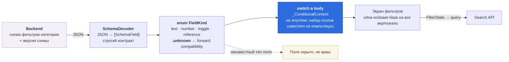

Захардкодить «количество комнат» и «объём двигателя» в клиенте — значит ждать ревью Apple ради нового поля. Что даёт: новая категория выкатывается без релиза, A/B-тесты состава фильтров, один рендеринг на все вертикали.

Этот же движок — `SchemaKit`, отдельный Platform-пакет рядом с `ListingKit`, — рендерит блок атрибутов в карточке объявления — см. 5.1. Одна схема описывает и «по чему ищем», и «что показываем».

**Тонкость, на которой ловятся многие.** Server-driven UI ≠ `AnyView`. Сервер выбирает из каталога примитивов, которые клиент уже умеет рисовать, а не присылает код. Значит набор типов известен на компиляции, значит это enum + `switch`, а не реестр `AnyView`. Кейс `.unknown` — и forward compatibility, и защита от краша на поле из будущей версии схемы.

Что усложняется — назвать честно: валидация, аналитика по полям, офлайн, версионирование схемы.

### 4.3 Путь данных при прокрутке

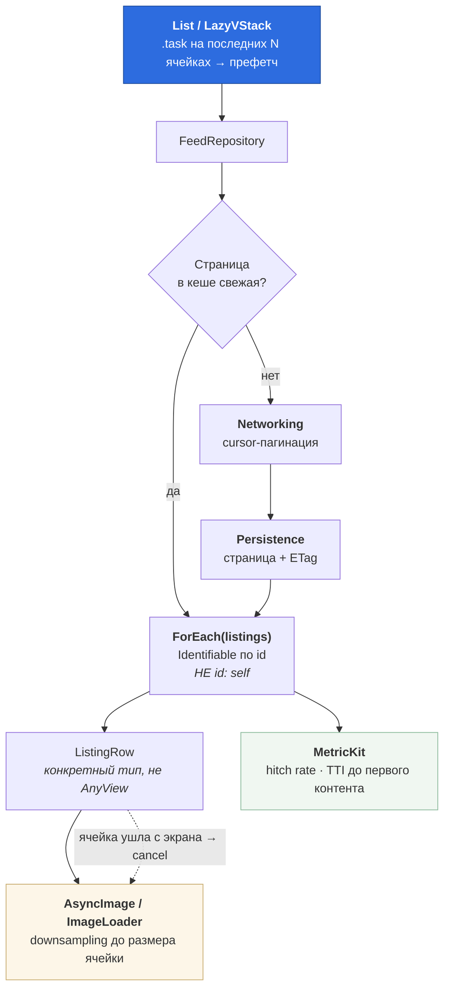

**Главное здесь.** Бесконечный скролл с картинками — главный экран и главный источник жалоб на память. Ключевое: downsampling до размера ячейки, а не хранение полноразмерного изображения; отмена загрузки, когда ячейка ушла с экрана; бюджет на hitch rate, зафиксированный числом, а не ощущением. В демо этот путь не реализован: репозитории ходят в стаб-транспорт без кеша, `Persistence` и `MetricKit` на схеме — продовая часть.

**Ловушка, специфичная для SwiftUI.** `ForEach(listings, id: \.self)` берёт идентификатором само значение. У объявления меняется счётчик просмотров или «5 минут назад» — другой хеш, для SwiftUI это другой элемент: удаление плюс вставка вместо обновления. Сервер вернул страницу, где у большинства элементов изменилось хоть что-то, — и весь видимый список перестраивается разом. `\.self` годится только для неизменяемых и уникальных значений: `AppTab.allCases`, статичные чипсы фильтра.

**Связка с продуктом.** Технические метрики соединяются с продуктовыми в одну цепочку: сократили TTI ленты → выросла глубина просмотра → выросло число контактов продавцам → выросла ликвидность, главная метрика классифайда.

---

## 5. Карточка объявления

Самая скользкая точка схемы, и вопрос про неё почти неизбежен.

### 5.1 Каркас и три линии разреза

Карточка не одна. Квартира, машина и пылесос — разные экраны: разная модель данных, разные действия (позвонить / записаться на просмотр / забронировать даты), разная монетизация. Две крайности одинаково плохи:

- **универсальный `ListingDetails` в одной вертикали** — она начинает импортировать соседей, ровно та красная стрелка со схемы 1;
- **пять независимых карточек** — пять команд чинят один и тот же баг с галереей.

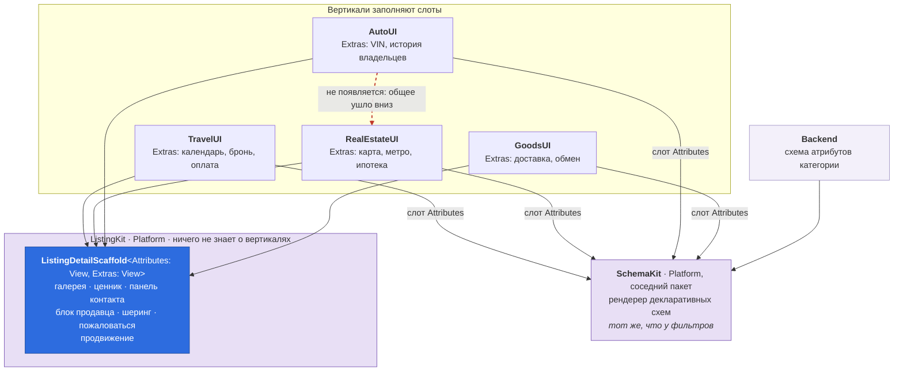

**Разрез проходит по трём линиям.**

*Общее для всех — в `ListingKit`.* Галерея, ценник, панель контакта, блок продавца, шеринг, жалоба, продвижение. Всё, что одинаково выглядит независимо от того, что продают.

*Атрибуты — данные, а не код.* «Пробег 120 000 км» и «Этаж 4 из 9» приходят той же схемой, что и фильтры. Различие между карточками сжимается до JSON, и новая категория не требует релиза.

*Вертикально-специфичное — код в вертикали.* Карта и метро в недвижимости, проверка VIN в авто, календарь и оплата в путешествиях. Это настоящая логика, она никуда не денется, и её место — рядом со своим доменом.

Как устроены слоты — в 5.2.

**Что держит границу:** в манифесте `ListingKit` нет ни одного `*Interface`, а импорт без записи в манифесте не пропустит линтер; протащить зависимость можно только правкой `Package.swift`, которую видно на ревью. Как только каркас узнаёт про недвижимость — он перестал быть каркасом.

**Ожидаемое возражение: «а если дизайн карточки авто разъедется с остальными?»** Тогда `Extras` разрастается, а `Scaffold` остаётся. Если разъезжается сам каркас — это сигнал, что вертикаль заслужила свою карточку целиком, и её выносят из `ListingKit` осознанно, а не втихую параметром `isAuto: Bool`. Булев флаг вертикали в общем компоненте — тот же красный флаг, что горизонтальный импорт.

### 5.2 Слоты: дженерики, а не `AnyView`

Каркас не хранит вью — он **параметризован их типами**, а конкретные типы подставляет вызывающая сторона.

```swift
// ListingKit — ничего не знает про авто и недвижимость
public struct ListingDetailScaffold<Attributes: View, Extras: View>: View {
    private let header: ListingHeader
    private let attributes: Attributes
    private let extras: Extras
    private let onSellerTap: () -> Void
    private let onContact: () -> Void

    public init(
        header: ListingHeader,
        onSellerTap: @escaping () -> Void,
        onContact: @escaping () -> Void,
        @ViewBuilder attributes: () -> Attributes,
        @ViewBuilder extras: () -> Extras
    ) { … }

    public var body: some View {
        ScrollView {
            VStack(alignment: .leading, spacing: Spacing.l) {
                Gallery(photoCount: header.photoCount, isPromoted: header.isPromoted)
                PriceBlock(header: header)
                attributes                                  // ← слот
                SellerBlock(seller: header.seller, onTap: onSellerTap)
                extras                                      // ← слот
            }
        }
        .safeAreaInset(edge: .bottom) { ContactBar(onContact: onContact) }
    }
}
```

Карточка авто — это вся вертикально-специфичная часть целиком:

```swift
// AutoUI
struct AutoDetailScreen: View {
    @Environment(Router.self) private var router
    @State private var model: AutoDetailModel

    private func card(for listing: AutoListing) -> some View {
        ListingDetailScaffold(
            header: ListingHeader(listing),
            // Каркас не знает маршрутов: переход наружу приезжает замыканием,
            // а куда идти, решает вертикаль.
            onSellerTap: {
                if listing.seller.isCompany {
                    router.push(AutoRoute.dealer(listing.seller.id))
                } else {
                    router.push(ProfileRoute.profile(listing.seller.id))
                }
            },
            onContact: { model.contactTapped() },
            attributes: {
                SchemaSection(fields: model.attributes)   // server-driven
            },
            extras: {
                VINReportCard(vin: listing.vin)
                OwnersHistory(records: listing.owners)
                if listing.hasDealerWarranty { DealerWarrantyBanner() }
            }
        )
    }
}
```

Галерея, ценник, панель контакта, блок продавца, шеринг, продвижение — ни строчки не продублировано. Появился зум в галерее — один PR в `ListingKit`, и его получили все пять вертикалей. Вот что значит «двести строк композиции, а не копия экрана».

**Что значит «тип выводится на месте вызова».** `Attributes` и `Extras` — не протоколы, а дырки, которые компилятор заполняет в точке вызова. Здесь получается:

```
ListingDetailScaffold<
    SchemaSection,
    TupleView<(VINReportCard, OwnersHistory,
               _ConditionalContent<DealerWarrantyBanner, EmptyView>)>
>
```

Этот тип никто не пишет руками — `some View` в `body` его прячет. Но компилятор знает его целиком, а значит SwiftUI знает форму поддерева до запуска: узлы аллоцируются один раз, сравнение POD-полей через `memcmp` отсекает ветки без вызова `body`.

`@ViewBuilder` нужен, чтобы в слот можно было писать обычный SwiftUI — несколько вью подряд, `if`, `switch`. Билдер собирает их в `TupleView` и `_ConditionalContent`, оставаясь конкретным типом.

**Что было бы с `AnyView`.** Каркас стал бы нежёнериковым: `let extras: AnyView`. Тип один и тот же у всех карточек, форма поддерева неизвестна. Конкретная поломка: пользователь на карточке авто раскрыл `VINReportCard`, пришёл апдейт модели и `hasDealerWarranty` переключился с `false` на `true` — тип внутри коробки сменился с `TupleView<(A, B, EmptyView)>` на `TupleView<(A, B, DealerWarrantyBanner)>`, поддерево снесено и построено заново, раскрытая секция схлопнулась, `AsyncImage` в отчёте перезагрузился. В Travel то же самое стирает выбранные даты в календаре.

**Тот же приём на границе приложения.** `RootView<Tabs: View, Login: View, Destinations: ViewModifier>` — корневая вью не знает, какие экраны в табах, типы приходят из composition root. Один механизм в двух местах: и на границе приложения, и на границе карточки.

**Где приём кончается.** Если сервер решает не только содержимое блоков, но и их состав и порядок, слотов фиксированной арности не хватает. Ответ тот же, что для фильтров: это всё равно каталог, значит `enum BlockKind` + `switch` внутри конкретной `BlockRow`, а не `[AnyView]`.

Честная цена дженериков: длинные сигнатуры, невозможность сложить такие вью в массив без стирания, и заметный рост времени тайпчека при глубокой вложенности билдеров — вплоть до «unable to type-check in reasonable time», если увлечься.

---

### 5.3 Диплинк на объявление

`kufar.by/item/12345` — вертикаль в ссылке не указана, а знает её только бэкенд.

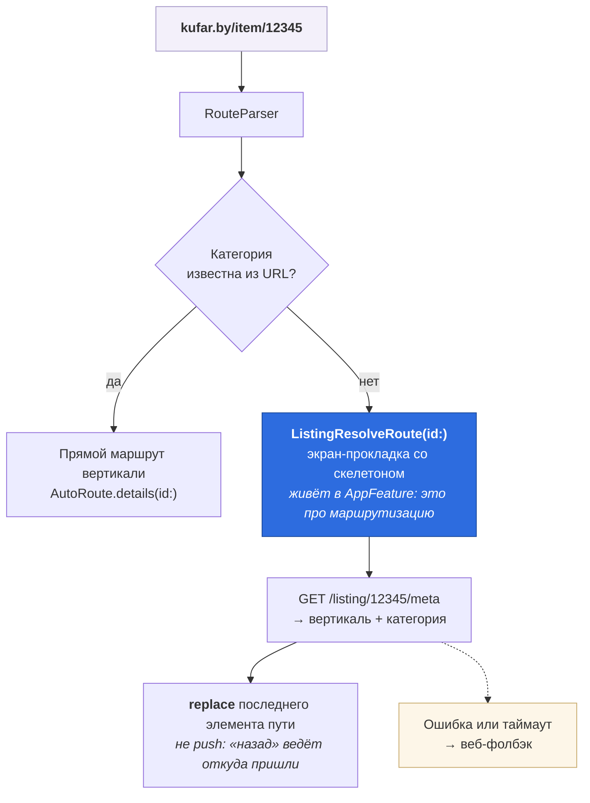

Три детали, которые отличают продуманный ответ от общего:

- **`replace`, а не `push`.** Иначе кнопка «назад» из карточки возвращает на экран загрузки. В `NavigationPath` это `removeLast()` плюс `append(...)` одним изменением.
- **Экран-прокладка живёт в `AppFeature`, а не в вертикали.** Он ни к одной не принадлежит — это маршрутизация. Сеть ему нужна через протокол `ListingResolving`, объявленный там же и реализованный в composition root. Тот же приём, что с `RequestInterceptor` в 2.2.
- **Лучше вообще не резолвить.** Если категория есть в URL (`/auto/12345`), прокладка не нужна. Это переговоры с бэкендом и SEO-командой о формате ссылок — и хороший пример того, что архитектурное решение здесь лежит не в клиенте.

### 5.4 Ошибка — состояние экрана, а не guard return

Мелочь, по которой на ревью отличают демо от продакшена. `guard let x = try? await ... else { return }` оставляет пользователя наедине с вечным спиннером: ошибка проглочена, экран навсегда «грузится».

```swift
// SharedKernel — чистый Swift, нужен каждой вертикали
public enum LoadState<Value: Sendable>: Sendable {
    case loading
    case loaded(Value)
    case failed
}
```

Три кейса вместо пары `listing: T?` + `isLoading: Bool` — невозможные комбинации непредставимы в типе. В `body` это `switch` → `_ConditionalContent`, тот же механизм, что у слотов: ветки сохраняют identity.

**На карточке два класса ошибок, и обрабатываются они по-разному.**

*Запрос самой карточки* — фатальный: `.failed`, полноэкранная заглушка с ретраем (`ErrorStateView` в `DesignComponents`: знает токены, не знает домен).

*Схема атрибутов* — вторичный контент: её поломка деградирует один блок, а не роняет экран. Но деградация не молчит — `schemaDecodeFailed` уходит в аналитику, иначе о сломанной схеме узнают из отзывов в App Store. Это другой уровень, чем `.unknown` у отдельного поля: неизвестный тип поля — норма forward compatibility, нечитаемая схема целиком — инцидент.

В демо `.failed` один; в проде здесь минимум два кейса — retryable (сеть) и терминальный (объявление снято), у них разные заглушки и разное поведение «Повторить».

---

## 6. Что ломается именно в SwiftUI

Архитектурные границы в SwiftUI упираются в устройство рендера, и это стоит показать явно: решения из предыдущих разделов держатся не только на дисциплине импортов, но и на том, сохраняет ли вью свой тип.

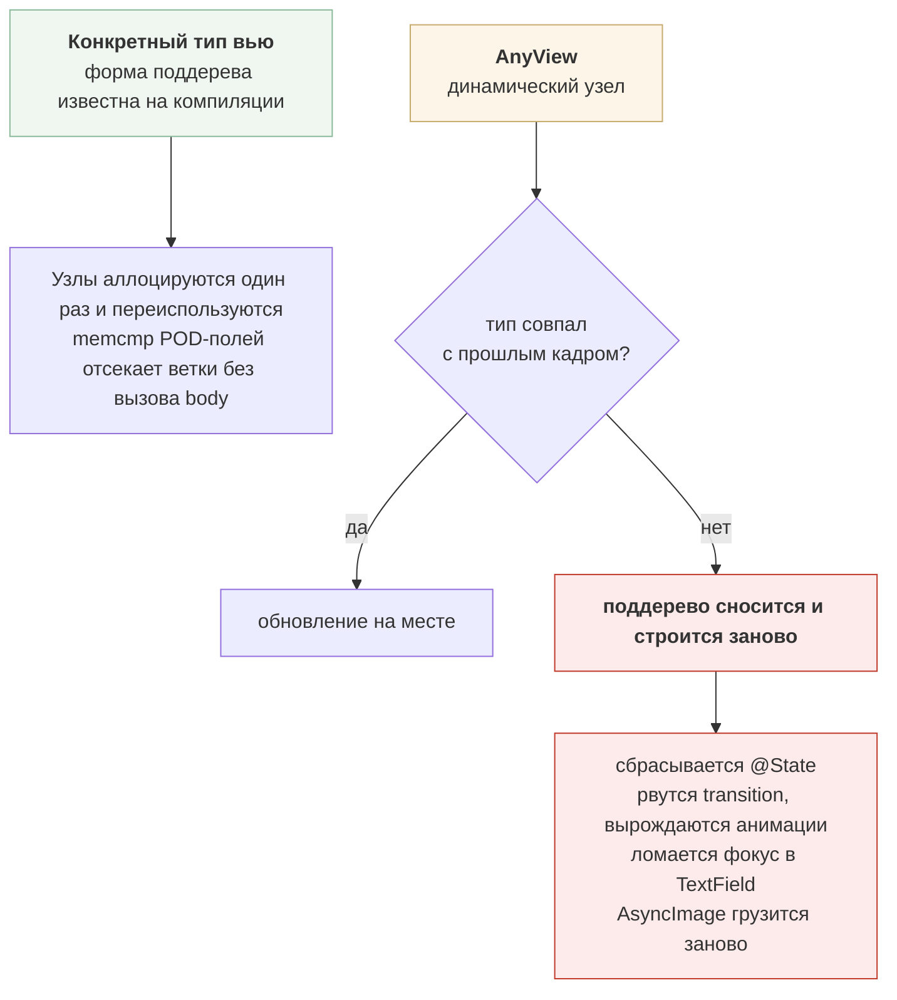

**Калибровка, чтобы не выглядеть фанатиком.** `List` и `LazyVStack` ленивы, `AnyView` этого не отменяет: на экране 12 ячеек — обсчитываются ~12–20, не 200. Стирание влияет на стоимость обновления узла, а не на их количество. Реальная боль — не FPS, а баги: сбрасывается ввод, рвутся анимации, «иногда теряется выделение». Их отлаживают часами, не связывая с `AnyView`.

**Правило, если стирание неизбежно:** опускай коробку как можно глубже. Всё выше неё сохраняет identity, всё внутри — теряет. `AnyView` вокруг строки списка убивает контейнер, паддинги, свайпы и `@State` строки; `AnyView` вокруг одного неизвестного блока внутри строки убивает только этот блок.

**Почему это архитектурный, а не косметический вопрос.** Публичный контракт фичи — enum маршрутов, а не `View` и не `AnyView`. Именно поэтому в интерфейсе нет `import SwiftUI`, а слоты каркаса карточки — дженерики, а не `[AnyView]`. Граница модулей и стабильность рендера — одно решение, принятое один раз.

**Важная поправка, которую стоит сделать самому.** Из этого не следует, что модуль вообще не может отдавать вью наружу — вертикали отдают: `AutoAssembly.rowAccessory(for:)` и `postingStep(_:draft:)` возвращают `some View`. Стирания там нет, потому что тип **непрозрачный, а не стёртый**: `some View` прячет конкретику от программиста, но не от компилятора, а принимающая сторона объявлена дженериком. Обязательным стирание становится в двух других случаях:

- **именованный тип вью в контракте** — тогда `*Interface` тянет `import SwiftUI`, и вся цепочка потребителей вместе с ним;
- **реестр вместо `switch`** — `[Vertical: (ListingRef) -> AnyView]`. У `Dictionary` один тип `Value`, разнотипные замыкания без коробки в него не сложить. Отсюда правило: `switch`, написанный в исходнике, компилятор видит целиком; таблица, собранная в рантайме, — нет. Тот же водораздел, что в 3.1 между `navigationDestination` и словарём обработчиков на UIKit.

**Чем это диагностируется:** `let _ = Self._printChanges()` в `body`. `@self changed` — вью пересоздана; имя конкретного свойства — обновление на месте. Плюс Instruments → SwiftUI → View Body: счётчик растёт быстрее числа появившихся ячеек — дерево перестраивается там, где могло обновиться.

---

## 7. «Чистая» ли это архитектура

Слово «чистая» применительно к этой схеме требует оговорки, поэтому она сделана явно:

> Это **не** Clean Architecture по форме. Это модульная архитектура с соблюдённым Dependency Rule.

Различение существенное: искать здесь интеракторы и презентеры бессмысленно, их нет и не должно быть.

### 7.1 Что от Clean Architecture сохранено

| Принцип | Где именно |
|---|---|
| **Dependency Rule** — зависимости к домену | `GoodsUI → GoodsDomain ← GoodsData`, красная стрелка в 1.3 |
| **Инверсия на границе фреймворка** | `RequestInterceptor`: `APIClient` внизу вызывает `AuthInterceptor` наверху, зависимость сборки идёт вниз — поток управления и граф противонаправлены (2.2) |
| **Подменяемость транспорта** | `*Data` держат `HTTPPerforming`, `import Networking` разрешён единственному таргету `AppComposition` — проверяется `deplint.py`. Инверсии здесь нет: вызов идёт сверху вниз, как и зависимость. Выигрыш — стаб `NetworkingTesting` вместо сети |
| **Домен не знает фреймворков** | `GoodsDomain` зависит только от `SharedKernel`, ни строчки SwiftUI |
| **Composition root** | единственное место с конкретными реализациями. `ListingResolving` объявлен потребителем в `AppFeature`, реализован корнем — та же инверсия, но на границе приложения, а не фреймворка (5.3) |
| **Тестируемость через границы** | `AppFeatureTests` собираются без сети, без `*Data`, без вертикалей |

То есть главный закон соблюдён и, что важнее, **проверяется системой сборки**: в списке зависимостей таргета `GoodsUI` пакета `GoodsData` просто нет — нарушение не соберётся.

### 7.2 Чего нет — то есть в чём отклонение

**Нет слоя юзкейсов.** В каноне Entities → Use Cases → Interface Adapters. Здесь вью-модель зовёт репозиторий напрямую: `repo.listing(id:)`. Классов `GetListingUseCase` с единственным `execute()` нет ни одного, и это решение, а не недоделка.

**Одна модель на все слои.** В каноне Entity → DTO → ViewModel с мапперами на каждой границе. `GoodsListing` едет из репозитория прямо в `body`. Мапперов нет.

**Нет Presenter.** Его роль растворена в `@Observable`-модели, которая отдаёт доменные типы во вью как есть.

**Верхний срез — по командам, а не по слоям.** Не `Domain/`, `Data/`, `Presentation/` на верхнем уровне, а `goods_team`, `search_team`, `auto_team`. Слои живут таргетами **внутри** вертикали.

**Главные решения проекта лежат вне CA.** Маршруты как data-only enum'ы, destinations как `ViewModifier`, слоты дженериками, identity поддерева — всё это про модель рендера SwiftUI, о которой Clean Architecture не говорит ничего. Разделы 3, 5 и 6 целиком за её пределами.

**Границы держит система сборки, а не дисциплина.** В каноне слои — соглашение, проверяемое на ревью. Здесь продукты SwiftPM, уровни доступа и линтер: единица изоляции — модуль, а не «круг».

### 7.3 Почему отклонения намеренные

**Дефицитный ресурс здесь другой.** Clean Architecture оптимизирует независимость от фреймворка и базы. У площадки с шестью командами узкое место — независимость **команд** друг от друга. Слои её не дают: можно соблюдать их идеально и всё равно получить репозиторий, где все блокируют всех. Даёт модульность — пакеты, продукты, контракты, релизные циклы.

**Независимость от SwiftUI — во многом фикция.** Навигация, identity, время жизни состояния — это и есть структура приложения (раздел 6). Проектировать так, будто SwiftUI можно вынуть и заменить, значит платить усложнением за то, чего не случится.

**Домен тонкий.** Клиент классифайда — транспорт и презентация над server-driven данными. Оркестрации, ради которой существует слой юзкейсов, почти нет: `AutoCredit` и `VINDecoder` — единственные настоящие доменные вычисления во всём проекте, и лежат они именно в домене.

**Пустой слой хуже отсутствующего.** `GetListingUseCase.execute()`, дословно пересылающий вызов в репозиторий, добавляет файл, тест и точку правки — и ни одного решения. Это тот же аргумент, что в «Где не надо» (2.3): протокол оправдан, когда реализация тяжёлая, заменяемая, мокаемая или чужая.

### 7.4 Когда полная церемония окупается

Сказать самому — иначе позиция звучит как отрицание, а не как выбор.

- **Толстый домен с правилами оркестрации** — банк, страхование, биллинг: там юзкейс это место, где живёт бизнес-решение, а не пересылка.
- **Несколько способов доставки над одним доменом** — приложение, виджет, watch, CLI: общий слой юзкейсов перестаёт быть дублированием.
- **Домен живёт дольше UI** — переписали интерфейс дважды, правила не менялись.

Ни одно из трёх здесь не выполняется. Появится — слой добавляют тогда, а не заранее: `GoodsDomain` для этого и существует, и добавление юзкейса не тронет ни `GoodsUI`, ни `GoodsData`.

---

## Как удержать это в живых

Схемы описывают целевое состояние. Без автоматики оно продержится квартал.

| Механизм | Что ловит |
|---|---|
| Линтер зависимостей в CI (`Tools/deplint.py`) | Импорт вертикали из вертикали, `import Networking` вне корня, `import SwiftUI` в `*Interface`, assembly вне `AppComposition`, импорт без записи в манифесте, папку не в формате `scope.Name` |
| Хост-тест всех маршрутов | Кейс `*Route`, для которого не подмешан `navigationDestination` |
| Демо-приложение на каждую вертикаль | Протёкшую горизонтальную зависимость |
| Время инкрементальной сборки в дашборде | Зависимость, протащенную наверх |
| Снапшот-тесты `DesignComponents` и `ListingKit` | Регресс общих компонентов без запуска приложения |
| Правило на ревью: `import *Testing` вне тестов | Утечку стабов в релиз — в SPM нет `.when(configuration: .debug)` |
| Грепом: вертикаль внутри общего компонента | `isAuto`, `isRealEstate` — зависимость, протащенную параметром; и `vertical == .auto ? … : …` — её же, протащенную сравнением. Тернарник опаснее флага: компилятор его не остановит, и новая вертикаль молча получит чужое имя. Отображаемое имя берут из `Vertical.title` — там `switch`, и он ломается там, где вертикаль заводят |
| Сборка воркспейса на PR в репозитории команды | Правку, которая ломает соседей, — до мержа и с понятным владельцем |
| Сборка воркспейса на HEAD всех репозиториев после мержа | Конфликт двух PR, зелёных против `main` по отдельности |
| Ночная сборка приложения из реестра, в двух режимах | Неопубликованную версию, пустое пересечение диапазонов, не поднятый пол в манифесте |
| Правило на ревью: ломающее изменение общего типа — только фазами | Попытку смержить новый кейс `Vertical` одним PR и уронить main трём командам (2.3) |

Таблица — целевой набор, и в демо она закрыта не целиком. Реализованы линтер, гейт и интеграция воркспейса, версионная ночная в двух режимах и обход всех маршрутов на `Codable`. Хост-теста destinations, демо-приложений вертикалей, снапшот-тестов и дашборда времени сборки в демо нет — это требования к рабочему проекту.

### Две сборки, потому что режима два

Про CI стоит сказать отдельно: в multi-repo вопрос «а как вы это собираете» имеет не один ответ, и выбрать один из них нельзя — нужны оба.

Локально пакеты подключены **локальной подменой**: Xcode сопоставляет зависимость с папкой в воркспейсе по identity и подставляет её вместо загрузки из реестра. Идентичность для реестра — это `scope.Name`, а у локального пакета она берётся из имени директории, отсюда правило «папка называется `kufar.Foundation`». Версии из манифестов при этом не проверяются вообще: сборка всегда идёт против HEAD соседа. Это семантика монорепозитория: правка в `SharedKernel` видна всем потребителям сразу, кросс-пакетное изменение делается одним движением.

На билд-сервере соседних папок нет, и зависимости приезжают из реестра по опубликованным версиям. Граф получается другой. Отсюда две сборки, и различаются они ровно одной вещью — присутствием соседних папок:

| | монорепо-режим | версионный режим |
|---|---|---|
| Соседи склонированы | да, `bootstrap.sh` | нет |
| Что участвует в резолве | ничего, подмена | версии из реестра и диапазоны из манифестов |
| Ловит | рассогласование незарелиженной работы | неопубликованная версия, пустое пересечение диапазонов, не поднятый пол в манифесте |

Ни один режим не подменяет другой. Монорепо-режим никогда не покажет конфликт версий — он их не смотрит. Версионный никогда не покажет, что правка ломает соседа, пока она не выпущена тегом.

**Где именно запускается монорепо-режим — отдельное решение, и оно важнее, чем кажется.** Интеграцию ломает мерж в репозиторий команды. Проверка, стоящая только в мета-репозитории, загорается уже после мержа, у другого владельца, и не отвечает на вопрос «чей PR виноват». Поэтому гейт стоит **на PR в репозитории команды**: он собирает весь воркспейс, подставив ревизию этого PR на место папки его команды. У проверки появляется владелец — автор PR, — и она перестаёт быть красной «нормально».

В мета-репозитории тот же режим остаётся после мержа, и ловит он то, чего гейт не видит принципиально: два PR, зелёные против `main` каждый по отдельности, после приземления обоих дают красное. Семантический конфликт проявляется только вместе.

| | где | когда |
|---|---|---|
| гейт | репозитории команд | на PR, до мержа |
| интеграция | мета-репозиторий | после мержа, по `repository_dispatch` |
| версионный | мета-репозиторий | ночью и по кнопке |

Тело у гейта одно на все шесть команд — переиспользуемый workflow в мета-репозитории, подключаемый по тегу. По тегу, а не по `main`, ровно по той же причине, по которой пакеты подключаются через `from:`: иначе правка в общем CI ломала бы шесть команд одновременно и без предупреждения.

**Тег без публикации бессмыслен.** Резолв идёт через реестр, поэтому оттегированная, но не опубликованная версия для потребителей не существует. `publish.sh --tag` делает обе операции одной командой именно поэтому: гит хранит исходники, реестр раздаёт релизы, и расходиться им нельзя.

**Два прогона версионной сборки — `pinned` и `latest`.** Первый отвечает «что соберётся у того, кто клонирует репозиторий сегодня», второй — «что произойдёт, когда кто-нибудь нажмёт Update to Latest Package Versions» (в CI это просто удаление `Package.resolved` перед резолвом). Расходятся они ровно тогда, когда сосед выпустил ломающую минорную версию, пообещав совместимость. Semver в SwiftPM — обещание автора, а не проверка: никто не сверяет API 1.1 с 1.0. Красный `latest` при зелёном `pinned` — это и есть автоматическая проверка чужого обещания.

**Порядок мержа снизу вверх — следствие, а не бюрократия.** Правка в `SharedKernel` плюс её использование в `GoodsUI` локально зелёные: обе папки на месте. В версионном режиме `kufar.Goods` резолвит `kufar.Foundation` по опубликованной версии, где нового типа ещё нет. Значит сначала мержится и публикуется `kufar.Foundation`, потом `kufar.Goods`. То, что в монолите было одним PR, здесь становится цепочкой — это честная цена изоляции команд, и лучше назвать её самому.

Работает это правило только для **аддитивных** изменений. Если правка ломающая — например, новый кейс в закрытом `Vertical`, — валидного порядка не существует вообще: любое промежуточное состояние красное. Тогда нужен фазовый переход, разобранный в 2.3.

**Чего здесь не хватает до настоящего CI.**

Первое — связь схемы с тестами. Тесты лежат в пакетах, схема живёт в проекте приложения, владельцы у них разные, а корректность связи между ними не проверяет никто. В этом демо она успела сломаться дважды: сначала `TestAction` был пуст и `xcodebuild test` прогонял ноль тестов, отчитываясь зелёным; потом появился тест-план, но лежал он не там, откуда отсчитаны пути внутри него, — `container:../kufar.AppComposition` указывал за пределы воркспейса. Оба раза поломка тихая, и оба раза её нашёл человек, а не проверка. Зелёный CI, не запускающий ни одного теста, — самый дорогой вид ложной уверенности, и защита от него должна быть автоматической: сравнивать число прогнанных тестов с ожидаемым.

Второе — нет проверки «поднял ли пол в манифесте, когда начал использовать новое API соседа». Она ловится только косвенно, красным `pinned` в версионном режиме, то есть после публикации.

**Про миграцию существующего монолита.** Целевая схема здесь описана как готовая, но так она не строится. Модуляризация идёт инкрементально: сначала выделяются листья графа — дизайн-система, сеть, общие модели, — у них нет входящих зависимостей, и вынос ничего не ломает. Затем контракты вертикалей, и только потом сами вертикали, по одной. Каждый шаг оставляет приложение собираемым, и на каждом можно остановиться. Порядок обратный тому, в котором рисуют схему.
