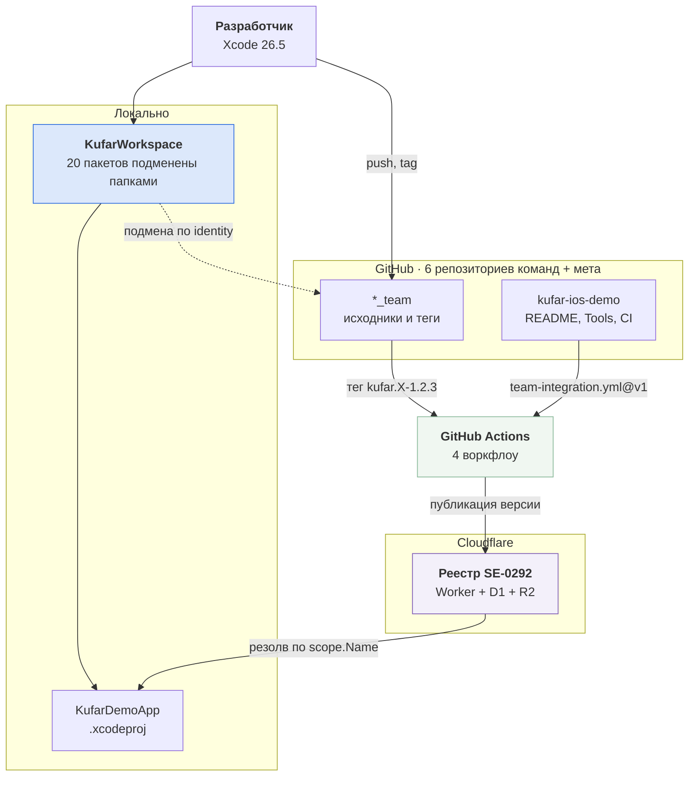
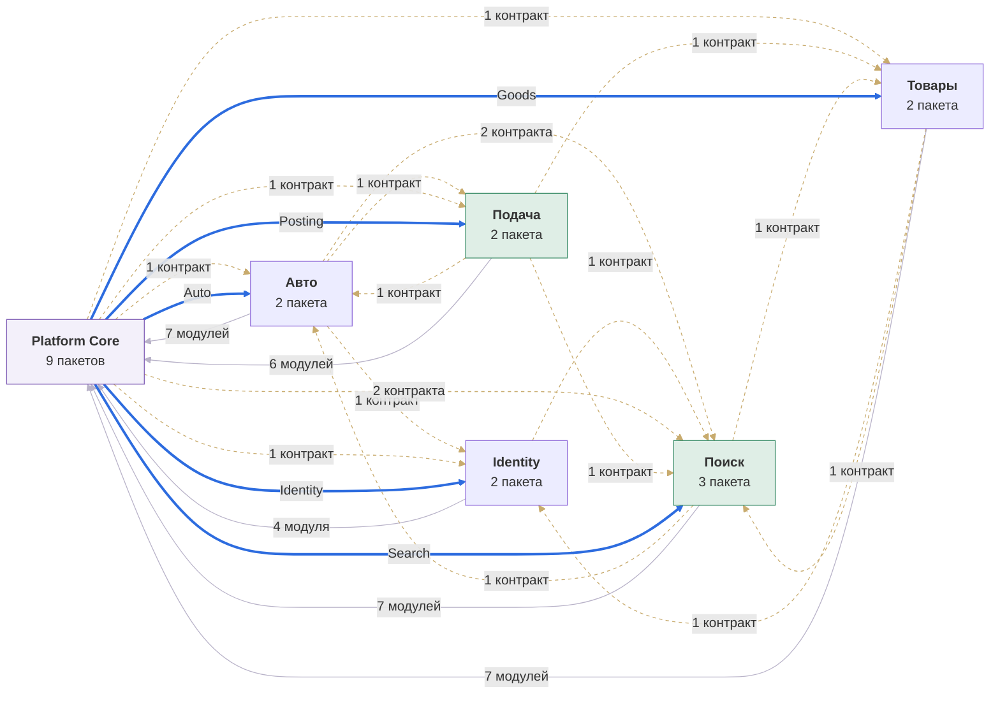
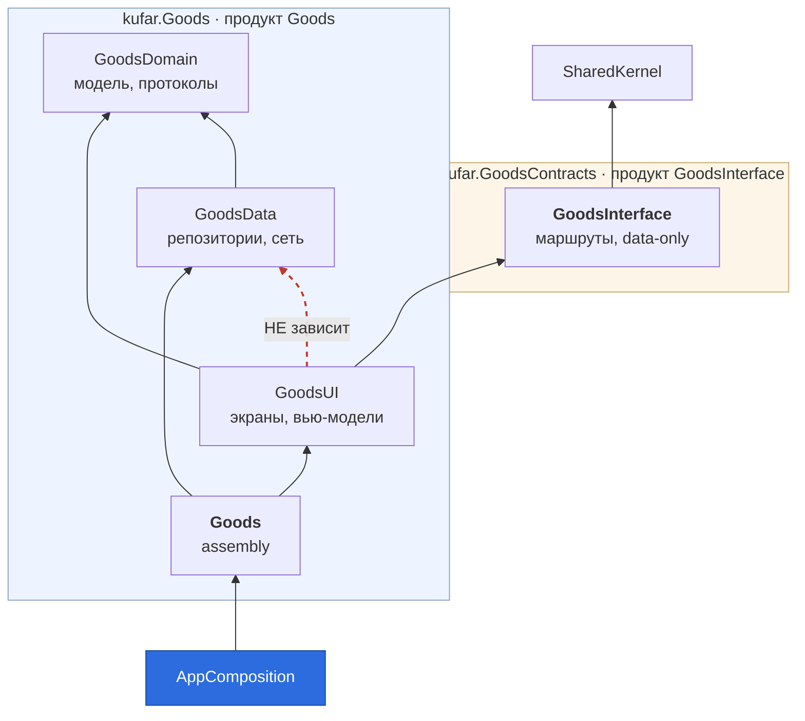
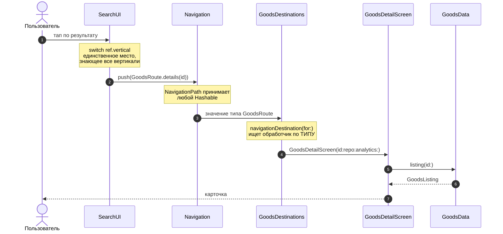

# Архитектура проекта целиком

Карта всего, что есть в `kufar-ios`: приложение, двадцать пакетов, шесть репозиториев, реестр, инструменты и CI. Пять уровней увеличения — от «что с чем разговаривает» до «что происходит при одном тапе».

Про архитектуру **приложения** — решения, компромиссы и почему именно так — отдельный документ: [architecture-ios-app.md](https://github.com/yklishevich/kufar-ios-demo/blob/main/architecture-ios-app.md). Здесь только карта.

> **Схемы уровней 2 и 3 сгенерированы** из тех же `Package.swift`, что читает линтер, — `python3 Tools/gen-graph.py`. Руками они не рисуются намеренно: за время работы над проектом рукописная карта трижды разошлась с кодом и каждый раз это находилось случайно. `gen-graph.py --check` в CI валит сборку, если схема отстала.

---

## Уровень 1. Контекст

Что вообще участвует и что кому отдаёт.

**Ключевая развилка проекта — два режима сборки одного и того же кода.**

| | Монорепо-режим | Версионный режим |
|---|---|---|
| Что открывают | `KufarWorkspace.xcworkspace` | `KufarDemo.xcodeproj` |
| Откуда пакеты | локальные папки, подмена по identity | реестр, по версиям из манифестов |
| Что видно | правка в соседнем пакете — сразу | только то, что опубликовано |
| Что ловит | ошибки кода, тесты | непубликованную версию, конфликт диапазонов |
| Воркфлоу | `workspace.yml`, `team-integration.yml` | `versioned.yml` |

Ни один из двух не заменяет другой. Монорепо-режим не видит версий вообще; версионный не запускает тесты пакетов, потому что тестовые таргеты зависимостям не собираются.

---

## Уровень 2. Команды и репозитории

Владение и то, кто кого может заблокировать. Внутрикомандные связи убраны — они не про координацию.

<!-- gen:teams -->

<!-- /gen:teams -->

Читается по одному признаку: **жирные синие стрелки выходят только из `platform_team`.** Это `AppComposition` — единственный, кому позволено знать реализации вертикалей. Появилась жирная стрелка из другой команды — граница поехала.

Пунктир — зависимость через контрактный пакет: маршруты и модели, ноль транзитивных ограничений. Таких большинство, и это норма. Серые — платформенные модули: ядро, сеть, навигация, дизайн-система.

<!-- gen:stats -->
| Команда | Пакетов | Продуктов | Таргетов | Зависит от чужих пакетов |
|---|---|---|---|---|
| **Platform Core** | 9 | 13 | 15 | 11 |
| **Поиск** | 3 | 3 | 6 | 9 |
| **Подача** | 2 | 2 | 5 | 9 |
| **Товары** | 2 | 2 | 5 | 9 |
| **Авто** | 2 | 2 | 5 | 11 |
| **Identity** | 2 | 6 | 9 | 5 |
| **Всего** | 20 | 28 | 45 | — |
<!-- /gen:stats -->

Репозиториев шесть, а команд шесть — но совпадение неполное: `platform_team` владеет девятью пакетами и держит их в одном репозитории. Почему так и когда бывает иначе — [README](https://github.com/yklishevich/kufar-ios-demo/blob/main/README.md#почему-команд-шесть-а-репозиториев-двадцать-один).

---

## Уровень 3. Пакеты

Полный граф. Цвет узла — уровень: зелёный Foundation, песочный контракты, сиреневый Platform, голубой вертикали, синий композиционный корень.

```mermaid
graph BT
    subgraph platform_team["Platform Core"]
        direction TB
        kufar_Foundation["Foundation"]
        kufar_Analytics["Analytics"]
        kufar_DesignComponents["DesignComponents"]
        kufar_DesignTokens["DesignTokens"]
        kufar_ListingKit["ListingKit"]
        kufar_Navigation["Navigation"]
        kufar_SchemaKit["SchemaKit"]
        kufar_AppFeature["AppFeature"]
        kufar_AppComposition["AppComposition"]
    end

    subgraph search_team["Поиск"]
        direction TB
        kufar_CatalogContracts["CatalogContracts"]
        kufar_SearchContracts["SearchContracts"]
        kufar_Search["Search"]
    end

    subgraph posting_team["Подача"]
        direction TB
        kufar_PostingContracts["PostingContracts"]
        kufar_Posting["Posting"]
    end

    subgraph goods_team["Товары"]
        direction TB
        kufar_GoodsContracts["GoodsContracts"]
        kufar_Goods["Goods"]
    end

    subgraph auto_team["Авто"]
        direction TB
        kufar_AutoContracts["AutoContracts"]
        kufar_Auto["Auto"]
    end

    subgraph identity_team["Identity"]
        direction TB
        kufar_IdentityContracts["IdentityContracts"]
        kufar_Identity["Identity"]
    end

    kufar_Analytics --> kufar_Foundation
    kufar_AppComposition --> kufar_Analytics
    kufar_AppComposition --> kufar_AppFeature
    kufar_AppComposition --> kufar_Auto
    kufar_AppComposition --> kufar_CatalogContracts
    kufar_AppComposition --> kufar_Foundation
    kufar_AppComposition --> kufar_Goods
    kufar_AppComposition --> kufar_Identity
    kufar_AppComposition --> kufar_IdentityContracts
    kufar_AppComposition --> kufar_ListingKit
    kufar_AppComposition --> kufar_Navigation
    kufar_AppComposition --> kufar_Posting
    kufar_AppComposition --> kufar_PostingContracts
    kufar_AppComposition --> kufar_Search
    kufar_AppFeature --> kufar_AutoContracts
    kufar_AppFeature --> kufar_DesignComponents
    kufar_AppFeature --> kufar_DesignTokens
    kufar_AppFeature --> kufar_Foundation
    kufar_AppFeature --> kufar_GoodsContracts
    kufar_AppFeature --> kufar_IdentityContracts
    kufar_AppFeature --> kufar_Navigation
    kufar_AppFeature --> kufar_PostingContracts
    kufar_AppFeature --> kufar_SearchContracts
    kufar_Auto --> kufar_Analytics
    kufar_Auto --> kufar_AutoContracts
    kufar_Auto --> kufar_CatalogContracts
    kufar_Auto --> kufar_DesignComponents
    kufar_Auto --> kufar_DesignTokens
    kufar_Auto --> kufar_Foundation
    kufar_Auto --> kufar_IdentityContracts
    kufar_Auto --> kufar_ListingKit
    kufar_Auto --> kufar_Navigation
    kufar_Auto --> kufar_PostingContracts
    kufar_Auto --> kufar_SchemaKit
    kufar_Auto --> kufar_SearchContracts
    kufar_AutoContracts --> kufar_Foundation
    kufar_CatalogContracts --> kufar_Foundation
    kufar_DesignComponents --> kufar_DesignTokens
    kufar_Goods --> kufar_Analytics
    kufar_Goods --> kufar_DesignComponents
    kufar_Goods --> kufar_DesignTokens
    kufar_Goods --> kufar_Foundation
    kufar_Goods --> kufar_GoodsContracts
    kufar_Goods --> kufar_IdentityContracts
    kufar_Goods --> kufar_ListingKit
    kufar_Goods --> kufar_Navigation
    kufar_Goods --> kufar_SchemaKit
    kufar_Goods --> kufar_SearchContracts
    kufar_GoodsContracts --> kufar_Foundation
    kufar_Identity --> kufar_DesignComponents
    kufar_Identity --> kufar_DesignTokens
    kufar_Identity --> kufar_Foundation
    kufar_Identity --> kufar_IdentityContracts
    kufar_Identity --> kufar_Navigation
    kufar_Identity --> kufar_SearchContracts
    kufar_IdentityContracts --> kufar_Foundation
    kufar_ListingKit --> kufar_DesignComponents
    kufar_ListingKit --> kufar_DesignTokens
    kufar_ListingKit --> kufar_Foundation
    kufar_Posting --> kufar_Analytics
    kufar_Posting --> kufar_AutoContracts
    kufar_Posting --> kufar_CatalogContracts
    kufar_Posting --> kufar_DesignComponents
    kufar_Posting --> kufar_DesignTokens
    kufar_Posting --> kufar_Foundation
    kufar_Posting --> kufar_GoodsContracts
    kufar_Posting --> kufar_Navigation
    kufar_Posting --> kufar_PostingContracts
    kufar_Posting --> kufar_SchemaKit
    kufar_PostingContracts --> kufar_CatalogContracts
    kufar_PostingContracts --> kufar_Foundation
    kufar_SchemaKit --> kufar_DesignComponents
    kufar_SchemaKit --> kufar_DesignTokens
    kufar_SchemaKit --> kufar_Foundation
    kufar_Search --> kufar_Analytics
    kufar_Search --> kufar_AutoContracts
    kufar_Search --> kufar_CatalogContracts
    kufar_Search --> kufar_DesignComponents
    kufar_Search --> kufar_DesignTokens
    kufar_Search --> kufar_Foundation
    kufar_Search --> kufar_GoodsContracts
    kufar_Search --> kufar_ListingKit
    kufar_Search --> kufar_Navigation
    kufar_Search --> kufar_SchemaKit
    kufar_Search --> kufar_SearchContracts
    kufar_SearchContracts --> kufar_CatalogContracts
    kufar_SearchContracts --> kufar_Foundation

    style kufar_Analytics fill:#f3f0fa,stroke:#a598c8
    style kufar_AppComposition fill:#2d6cdf,stroke:#1b4a9c,color:#fff
    style kufar_AppFeature fill:#dce8fb,stroke:#2d6cdf
    style kufar_Auto fill:#eef4ff,stroke:#8aa4c8
    style kufar_AutoContracts fill:#fdf6e8,stroke:#c8ab6e
    style kufar_CatalogContracts fill:#fdf6e8,stroke:#c8ab6e
    style kufar_DesignComponents fill:#f3f0fa,stroke:#a598c8
    style kufar_DesignTokens fill:#f3f0fa,stroke:#a598c8
    style kufar_Foundation fill:#f0f7f1,stroke:#8ab99a
    style kufar_Goods fill:#eef4ff,stroke:#8aa4c8
    style kufar_GoodsContracts fill:#fdf6e8,stroke:#c8ab6e
    style kufar_Identity fill:#eef4ff,stroke:#8aa4c8
    style kufar_IdentityContracts fill:#fdf6e8,stroke:#c8ab6e
    style kufar_ListingKit fill:#f3f0fa,stroke:#a598c8
    style kufar_Navigation fill:#f3f0fa,stroke:#a598c8
    style kufar_Posting fill:#eef4ff,stroke:#8aa4c8
    style kufar_PostingContracts fill:#fdf6e8,stroke:#c8ab6e
    style kufar_SchemaKit fill:#f3f0fa,stroke:#a598c8
    style kufar_Search fill:#eef4ff,stroke:#8aa4c8
    style kufar_SearchContracts fill:#fdf6e8,stroke:#c8ab6e
```

<!-- gen:packages -->

<!-- /gen:packages -->

Правило, которое эта схема обязана подтверждать: **стрелки идут только вниз по цветам**. Голубой в голубой — горизонтальная зависимость между вертикалями, её ловит `deplint.py`.

---

## Уровень 4. Внутри вертикали

Одинаково устроены все пять, поэтому в разрезе показана одна.

Два пакета, а не один, — чтобы контракт и реализация версионировались раздельно. `GoodsUI`, `GoodsData` и `GoodsDomain` продуктами не объявлены: импортировать их извне не даст SwiftPM.

---

## Уровень 5. Что происходит при одном тапе

Путь от нажатия в ленте до экрана карточки — через все слои сразу.

Что здесь важно: `SearchUI` не знает ни одного экрана вертикали, а `GoodsDestinations` не знает, кто его вызвал. Связь возникает в рантайме по типу маршрута, а на уровне сборки поиск зависит только от `GoodsInterface`.

---

## Инструменты

| Скрипт | Что делает | Когда нужен |
|---|---|---|
| `bootstrap.sh` | клонирует репозитории команд, открывает воркспейс | первый запуск на машине |
| `deplint.py` | десять правил графа: уровни, горизонталь, продукты, циклы | каждый PR, ubuntu, без Xcode |
| `gen-graph.py` | генерирует схемы этого документа из манифестов | после изменения графа |
| `publish.sh` | коммит, пуш, тег и публикация версии | релиз пакета |
| `republish-all.sh` | восстановление реестра по тегам гита | после сброса реестра |
| `check-registry.sh` | отвечает ли реестр и что в нём есть | когда Xcode не может добавить зависимость |
| `reset-all.sh` | схлопывание истории всех репозиториев | разовая операция |

---

## Чем проверяется, что схема не врёт

Три уровня, каждый ловит своё.

**`deplint.py`** — читает манифесты и исходники, сверяет каждый `import` с объявленным графом. Работает на ubuntu без Xcode и без сети, поэтому стоит первым шагом в CI: ломать сборку на macOS-раннере ради ошибки, видимой из текста, дорого.

**`BoundaryTests`** — те же правила, но запускаются вместе с обычными тестами в Xcode. Плюс проверка, которой нет у линтера: что корень воркспейса вообще нашёлся. Без неё остальные проверки в файле зеленели бы на пустом обходе — самый дорогой вид поломки, потому что выглядит как успех.

**`gen-graph.py --check`** — сравнивает схемы в этом документе с манифестами. Расходятся — сборка красная.

Тесты кода живут в пакетах: `AppFeatureTests` в `kufar.AppFeature`, и собираются они без сети, без единого `*Data` и без единой вертикали.
