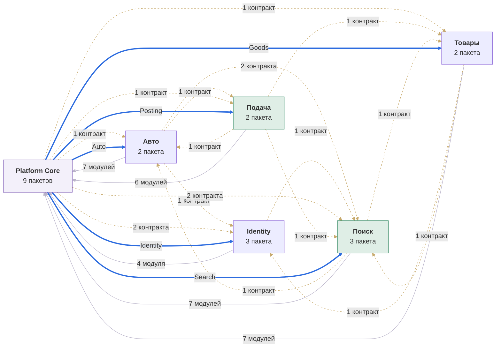
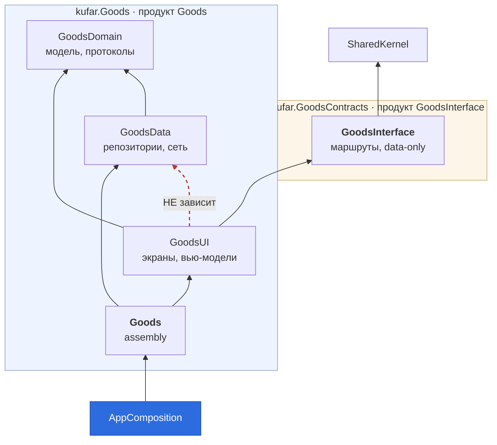
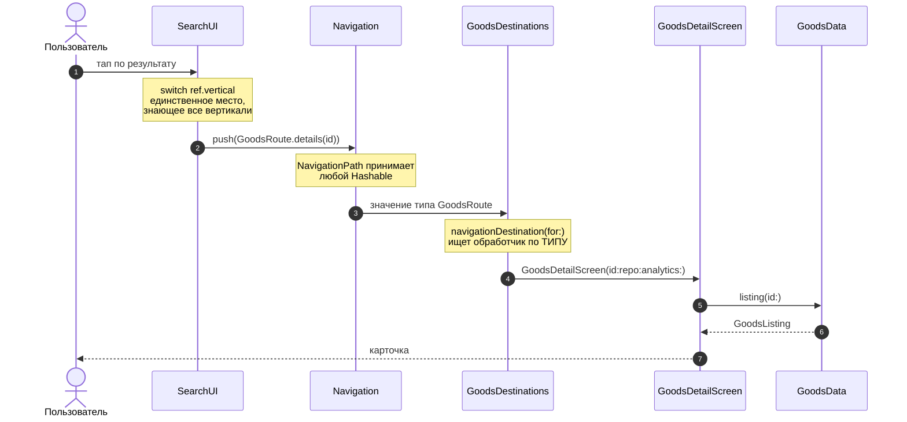

# Архитектура проекта целиком

Карта всего, что есть в `kufar-ios`: приложение, двадцать один пакет, шесть репозиториев, реестр, инструменты и CI. Пять уровней увеличения — от «что с чем разговаривает» до «что происходит при одном тапе».

Про архитектуру **приложения** — решения, компромиссы и почему именно так — отдельный документ: [architecture-ios-app.md](https://github.com/yklishevich/kufar-ios-demo/blob/main/architecture-ios-app.md). Здесь только карта.

> **Схемы уровней 2 и 3 сгенерированы** из тех же `Package.swift`, что читает линтер, — `python3 Tools/gen-graph.py`. Руками они не рисуются намеренно: за время работы над проектом рукописная карта трижды разошлась с кодом и каждый раз это находилось случайно. `gen-graph.py --check` в CI валит сборку, если схема отстала.

---

## Уровень 1. Контекст

Что вообще участвует и что кому отдаёт.

**Ключевая развилка проекта — два режима сборки одного и того же кода.**

| | Монорепо-режим | Версионный режим |
|---|---|---|
| Что открывают | `KufarWorkspace.xcworkspace` | `KufarDemo.xcodeproj` |
| Откуда пакеты | локальные папки, подмена по identity | реестр, по версиям из манифестов |
| Что видно | правка в соседнем пакете — сразу | только то, что опубликовано |
| Что ловит | ошибки кода, тесты | непубликованную версию, конфликт диапазонов |
| Воркфлоу | `workspace.yml`, `team-integration.yml` | `versioned.yml` |

Ни один из двух не заменяет другой. Монорепо-режим не видит версий вообще; версионный не запускает тесты пакетов, потому что тестовые таргеты зависимостям не собираются.

---

## Уровень 2. Команды и репозитории

Владение и то, кто кого может заблокировать. Внутрикомандные связи убраны — они не про координацию.

<!-- gen:teams -->

<!-- /gen:teams -->

Читается по одному признаку: **жирные синие стрелки выходят только из `platform_team`.** Это `AppComposition` — единственный, кому позволено знать реализации вертикалей. Появилась жирная стрелка из другой команды — граница поехала.

Пунктир — зависимость через контрактный пакет: маршруты и модели, ноль транзитивных ограничений. Таких большинство, и это норма. Серые — платформенные модули: ядро, сеть, навигация, дизайн-система.

<!-- gen:stats -->
| Команда | Пакетов | Продуктов | Таргетов | Зависит от чужих пакетов |
|---|---|---|---|---|
| **Platform Core** | 9 | 13 | 15 | 12 |
| **Поиск** | 3 | 3 | 6 | 9 |
| **Подача** | 2 | 2 | 5 | 9 |
| **Товары** | 2 | 2 | 5 | 9 |
| **Авто** | 2 | 2 | 5 | 11 |
| **Identity** | 3 | 6 | 9 | 5 |
| **Всего** | 21 | 28 | 45 | — |
<!-- /gen:stats -->

Репозиториев шесть, а команд шесть — но совпадение неполное: `platform_team` владеет девятью пакетами и держит их в одном репозитории. Почему так и когда бывает иначе — [README](https://github.com/yklishevich/kufar-ios-demo/blob/main/README.md#почему-команд-шесть-а-пакетов-двадцать-один).

---

## Уровень 3. Пакеты

Полный граф. Цвет узла — уровень: зелёный Foundation, песочный контракты, сиреневый Platform, голубой вертикали, синий композиционный корень.

```mermaid
graph BT
    subgraph platform_team["Platform Core"]
        direction TB
        kufar_Foundation["Foundation"]
        kufar_Analytics["Analytics"]
        kufar_DesignComponents["DesignComponents"]
        kufar_DesignTokens["DesignTokens"]
        kufar_ListingKit["ListingKit"]
        kufar_Navigation["Navigation"]
        kufar_SchemaKit["SchemaKit"]
        kufar_AppFeature["AppFeature"]
        kufar_AppComposition["AppComposition"]
    end

    subgraph search_team["Поиск"]
        direction TB
        kufar_CatalogContracts["CatalogContracts"]
        kufar_SearchContracts["SearchContracts"]
        kufar_Search["Search"]
    end

    subgraph posting_team["Подача"]
        direction TB
        kufar_PostingContracts["PostingContracts"]
        kufar_Posting["Posting"]
    end

    subgraph goods_team["Товары"]
        direction TB
        kufar_GoodsContracts["GoodsContracts"]
        kufar_Goods["Goods"]
    end

    subgraph auto_team["Авто"]
        direction TB
        kufar_AutoContracts["AutoContracts"]
        kufar_Auto["Auto"]
    end

    subgraph identity_team["Identity"]
        direction TB
        kufar_IdentityContracts["IdentityContracts"]
        kufar_SessionContracts["SessionContracts"]
        kufar_Identity["Identity"]
    end

    kufar_Analytics --> kufar_Foundation
    kufar_AppComposition --> kufar_Analytics
    kufar_AppComposition --> kufar_AppFeature
    kufar_AppComposition --> kufar_Auto
    kufar_AppComposition --> kufar_CatalogContracts
    kufar_AppComposition --> kufar_Foundation
    kufar_AppComposition --> kufar_Goods
    kufar_AppComposition --> kufar_Identity
    kufar_AppComposition --> kufar_ListingKit
    kufar_AppComposition --> kufar_Navigation
    kufar_AppComposition --> kufar_Posting
    kufar_AppComposition --> kufar_PostingContracts
    kufar_AppComposition --> kufar_Search
    kufar_AppComposition --> kufar_SessionContracts
    kufar_AppFeature --> kufar_AutoContracts
    kufar_AppFeature --> kufar_DesignComponents
    kufar_AppFeature --> kufar_DesignTokens
    kufar_AppFeature --> kufar_Foundation
    kufar_AppFeature --> kufar_GoodsContracts
    kufar_AppFeature --> kufar_IdentityContracts
    kufar_AppFeature --> kufar_Navigation
    kufar_AppFeature --> kufar_PostingContracts
    kufar_AppFeature --> kufar_SearchContracts
    kufar_AppFeature --> kufar_SessionContracts
    kufar_Auto --> kufar_Analytics
    kufar_Auto --> kufar_AutoContracts
    kufar_Auto --> kufar_CatalogContracts
    kufar_Auto --> kufar_DesignComponents
    kufar_Auto --> kufar_DesignTokens
    kufar_Auto --> kufar_Foundation
    kufar_Auto --> kufar_IdentityContracts
    kufar_Auto --> kufar_ListingKit
    kufar_Auto --> kufar_Navigation
    kufar_Auto --> kufar_PostingContracts
    kufar_Auto --> kufar_SchemaKit
    kufar_Auto --> kufar_SearchContracts
    kufar_AutoContracts --> kufar_Foundation
    kufar_CatalogContracts --> kufar_Foundation
    kufar_DesignComponents --> kufar_DesignTokens
    kufar_Goods --> kufar_Analytics
    kufar_Goods --> kufar_DesignComponents
    kufar_Goods --> kufar_DesignTokens
    kufar_Goods --> kufar_Foundation
    kufar_Goods --> kufar_GoodsContracts
    kufar_Goods --> kufar_IdentityContracts
    kufar_Goods --> kufar_ListingKit
    kufar_Goods --> kufar_Navigation
    kufar_Goods --> kufar_SchemaKit
    kufar_Goods --> kufar_SearchContracts
    kufar_GoodsContracts --> kufar_Foundation
    kufar_Identity --> kufar_DesignComponents
    kufar_Identity --> kufar_DesignTokens
    kufar_Identity --> kufar_Foundation
    kufar_Identity --> kufar_IdentityContracts
    kufar_Identity --> kufar_Navigation
    kufar_Identity --> kufar_SearchContracts
    kufar_Identity --> kufar_SessionContracts
    kufar_IdentityContracts --> kufar_Foundation
    kufar_ListingKit --> kufar_DesignComponents
    kufar_ListingKit --> kufar_DesignTokens
    kufar_ListingKit --> kufar_Foundation
    kufar_Posting --> kufar_Analytics
    kufar_Posting --> kufar_AutoContracts
    kufar_Posting --> kufar_CatalogContracts
    kufar_Posting --> kufar_DesignComponents
    kufar_Posting --> kufar_DesignTokens
    kufar_Posting --> kufar_Foundation
    kufar_Posting --> kufar_GoodsContracts
    kufar_Posting --> kufar_Navigation
    kufar_Posting --> kufar_PostingContracts
    kufar_Posting --> kufar_SchemaKit
    kufar_PostingContracts --> kufar_CatalogContracts
    kufar_PostingContracts --> kufar_Foundation
    kufar_SchemaKit --> kufar_DesignComponents
    kufar_SchemaKit --> kufar_DesignTokens
    kufar_SchemaKit --> kufar_Foundation
    kufar_Search --> kufar_Analytics
    kufar_Search --> kufar_AutoContracts
    kufar_Search --> kufar_CatalogContracts
    kufar_Search --> kufar_DesignComponents
    kufar_Search --> kufar_DesignTokens
    kufar_Search --> kufar_Foundation
    kufar_Search --> kufar_GoodsContracts
    kufar_Search --> kufar_ListingKit
    kufar_Search --> kufar_Navigation
    kufar_Search --> kufar_SchemaKit
    kufar_Search --> kufar_SearchContracts
    kufar_SearchContracts --> kufar_CatalogContracts
    kufar_SearchContracts --> kufar_Foundation
    kufar_SessionContracts --> kufar_Foundation

    style kufar_Analytics fill:#f3f0fa,stroke:#a598c8
    style kufar_AppComposition fill:#2d6cdf,stroke:#1b4a9c,color:#fff
    style kufar_AppFeature fill:#dce8fb,stroke:#2d6cdf
    style kufar_Auto fill:#eef4ff,stroke:#8aa4c8
    style kufar_AutoContracts fill:#fdf6e8,stroke:#c8ab6e
    style kufar_CatalogContracts fill:#fdf6e8,stroke:#c8ab6e
    style kufar_DesignComponents fill:#f3f0fa,stroke:#a598c8
    style kufar_DesignTokens fill:#f3f0fa,stroke:#a598c8
    style kufar_Foundation fill:#f0f7f1,stroke:#8ab99a
    style kufar_Goods fill:#eef4ff,stroke:#8aa4c8
    style kufar_GoodsContracts fill:#fdf6e8,stroke:#c8ab6e
    style kufar_Identity fill:#eef4ff,stroke:#8aa4c8
    style kufar_IdentityContracts fill:#fdf6e8,stroke:#c8ab6e
    style kufar_ListingKit fill:#f3f0fa,stroke:#a598c8
    style kufar_Navigation fill:#f3f0fa,stroke:#a598c8
    style kufar_Posting fill:#eef4ff,stroke:#8aa4c8
    style kufar_PostingContracts fill:#fdf6e8,stroke:#c8ab6e
    style kufar_SchemaKit fill:#f3f0fa,stroke:#a598c8
    style kufar_Search fill:#eef4ff,stroke:#8aa4c8
    style kufar_SearchContracts fill:#fdf6e8,stroke:#c8ab6e
    style kufar_SessionContracts fill:#fdf6e8,stroke:#c8ab6e
```

<!-- gen:packages -->

<!-- /gen:packages -->

Правило, которое эта схема обязана подтверждать: **стрелки идут только вниз по цветам**. Голубой в голубой — горизонтальная зависимость между вертикалями, её ловит `deplint.py`.

### Продукты внутри пакетов

Тот же граф на уровень мельче. Коробка — пакет, единица **резолва**. Узел внутри — продукт, единица **линковки**. Стрелка входит в узел, но версию тянет вся коробка, и в этом расхождении живут все компромиссы следующего раздела.

```mermaid
graph BT
    subgraph kufar_Foundation["Foundation"]
        direction TB
        kufar_Foundation__Networking["Networking"]
        kufar_Foundation__NetworkingInterface["NetworkingInterface"]
        kufar_Foundation__NetworkingTesting["NetworkingTesting"]
        kufar_Foundation__SharedKernel["SharedKernel"]
    end
    subgraph kufar_AutoContracts["AutoContracts"]
        direction TB
        kufar_AutoContracts__AutoInterface["AutoInterface"]
    end
    subgraph kufar_CatalogContracts["CatalogContracts"]
        direction TB
        kufar_CatalogContracts__CatalogContracts["CatalogContracts"]
    end
    subgraph kufar_GoodsContracts["GoodsContracts"]
        direction TB
        kufar_GoodsContracts__GoodsInterface["GoodsInterface"]
    end
    subgraph kufar_IdentityContracts["IdentityContracts"]
        direction TB
        kufar_IdentityContracts__AuthInterface["AuthInterface"]
        kufar_IdentityContracts__ProfileInterface["ProfileInterface"]
    end
    subgraph kufar_PostingContracts["PostingContracts"]
        direction TB
        kufar_PostingContracts__PostingInterface["PostingInterface"]
    end
    subgraph kufar_SearchContracts["SearchContracts"]
        direction TB
        kufar_SearchContracts__SearchInterface["SearchInterface"]
    end
    subgraph kufar_SessionContracts["SessionContracts"]
        direction TB
        kufar_SessionContracts__SessionInterface["SessionInterface"]
        kufar_SessionContracts__SessionInterfaceTesting["SessionInterfaceTesting"]
    end
    subgraph kufar_Analytics["Analytics"]
        direction TB
        kufar_Analytics__AnalyticsAPI["AnalyticsAPI"]
        kufar_Analytics__AnalyticsImpl["AnalyticsImpl"]
    end
    subgraph kufar_DesignComponents["DesignComponents"]
        direction TB
        kufar_DesignComponents__DesignComponents["DesignComponents"]
    end
    subgraph kufar_DesignTokens["DesignTokens"]
        direction TB
        kufar_DesignTokens__DesignTokens["DesignTokens"]
    end
    subgraph kufar_ListingKit["ListingKit"]
        direction TB
        kufar_ListingKit__ListingKit["ListingKit"]
    end
    subgraph kufar_Navigation["Navigation"]
        direction TB
        kufar_Navigation__Navigation["Navigation"]
    end
    subgraph kufar_SchemaKit["SchemaKit"]
        direction TB
        kufar_SchemaKit__SchemaKit["SchemaKit"]
    end
    subgraph kufar_Auto["Auto"]
        direction TB
        kufar_Auto__Auto["Auto"]
    end
    subgraph kufar_Goods["Goods"]
        direction TB
        kufar_Goods__Goods["Goods"]
    end
    subgraph kufar_Identity["Identity"]
        direction TB
        kufar_Identity__Auth["Auth"]
        kufar_Identity__Profile["Profile"]
    end
    subgraph kufar_Posting["Posting"]
        direction TB
        kufar_Posting__Posting["Posting"]
    end
    subgraph kufar_Search["Search"]
        direction TB
        kufar_Search__Search["Search"]
    end
    subgraph kufar_AppFeature["AppFeature"]
        direction TB
        kufar_AppFeature__AppFeature["AppFeature"]
    end
    subgraph kufar_AppComposition["AppComposition"]
        direction TB
        kufar_AppComposition__AppComposition["AppComposition"]
    end

    kufar_Analytics__AnalyticsAPI --> kufar_Foundation__SharedKernel
    kufar_Analytics__AnalyticsImpl --> kufar_Foundation__NetworkingInterface
    kufar_Analytics__AnalyticsImpl --> kufar_Foundation__SharedKernel
    kufar_AppComposition__AppComposition --> kufar_Analytics__AnalyticsAPI
    kufar_AppComposition__AppComposition --> kufar_Analytics__AnalyticsImpl
    kufar_AppComposition__AppComposition --> kufar_AppFeature__AppFeature
    kufar_AppComposition__AppComposition --> kufar_Auto__Auto
    kufar_AppComposition__AppComposition --> kufar_CatalogContracts__CatalogContracts
    kufar_AppComposition__AppComposition --> kufar_Foundation__Networking
    kufar_AppComposition__AppComposition --> kufar_Foundation__SharedKernel
    kufar_AppComposition__AppComposition --> kufar_Goods__Goods
    kufar_AppComposition__AppComposition --> kufar_Identity__Auth
    kufar_AppComposition__AppComposition --> kufar_Identity__Profile
    kufar_AppComposition__AppComposition --> kufar_ListingKit__ListingKit
    kufar_AppComposition__AppComposition --> kufar_Navigation__Navigation
    kufar_AppComposition__AppComposition --> kufar_Posting__Posting
    kufar_AppComposition__AppComposition --> kufar_PostingContracts__PostingInterface
    kufar_AppComposition__AppComposition --> kufar_Search__Search
    kufar_AppComposition__AppComposition --> kufar_SessionContracts__SessionInterface
    kufar_AppFeature__AppFeature --> kufar_AutoContracts__AutoInterface
    kufar_AppFeature__AppFeature --> kufar_DesignComponents__DesignComponents
    kufar_AppFeature__AppFeature --> kufar_DesignTokens__DesignTokens
    kufar_AppFeature__AppFeature --> kufar_Foundation__SharedKernel
    kufar_AppFeature__AppFeature --> kufar_GoodsContracts__GoodsInterface
    kufar_AppFeature__AppFeature --> kufar_IdentityContracts__ProfileInterface
    kufar_AppFeature__AppFeature --> kufar_Navigation__Navigation
    kufar_AppFeature__AppFeature --> kufar_PostingContracts__PostingInterface
    kufar_AppFeature__AppFeature --> kufar_SearchContracts__SearchInterface
    kufar_AppFeature__AppFeature --> kufar_SessionContracts__SessionInterface
    kufar_AppFeature__AppFeature --> kufar_SessionContracts__SessionInterfaceTesting
    kufar_Auto__Auto --> kufar_Analytics__AnalyticsAPI
    kufar_Auto__Auto --> kufar_AutoContracts__AutoInterface
    kufar_Auto__Auto --> kufar_CatalogContracts__CatalogContracts
    kufar_Auto__Auto --> kufar_DesignComponents__DesignComponents
    kufar_Auto__Auto --> kufar_DesignTokens__DesignTokens
    kufar_Auto__Auto --> kufar_Foundation__NetworkingInterface
    kufar_Auto__Auto --> kufar_Foundation__SharedKernel
    kufar_Auto__Auto --> kufar_IdentityContracts__ProfileInterface
    kufar_Auto__Auto --> kufar_ListingKit__ListingKit
    kufar_Auto__Auto --> kufar_Navigation__Navigation
    kufar_Auto__Auto --> kufar_PostingContracts__PostingInterface
    kufar_Auto__Auto --> kufar_SchemaKit__SchemaKit
    kufar_Auto__Auto --> kufar_SearchContracts__SearchInterface
    kufar_AutoContracts__AutoInterface --> kufar_Foundation__SharedKernel
    kufar_CatalogContracts__CatalogContracts --> kufar_Foundation__SharedKernel
    kufar_DesignComponents__DesignComponents --> kufar_DesignTokens__DesignTokens
    kufar_Goods__Goods --> kufar_Analytics__AnalyticsAPI
    kufar_Goods__Goods --> kufar_DesignComponents__DesignComponents
    kufar_Goods__Goods --> kufar_DesignTokens__DesignTokens
    kufar_Goods__Goods --> kufar_Foundation__NetworkingInterface
    kufar_Goods__Goods --> kufar_Foundation__SharedKernel
    kufar_Goods__Goods --> kufar_GoodsContracts__GoodsInterface
    kufar_Goods__Goods --> kufar_IdentityContracts__ProfileInterface
    kufar_Goods__Goods --> kufar_ListingKit__ListingKit
    kufar_Goods__Goods --> kufar_Navigation__Navigation
    kufar_Goods__Goods --> kufar_SchemaKit__SchemaKit
    kufar_Goods__Goods --> kufar_SearchContracts__SearchInterface
    kufar_GoodsContracts__GoodsInterface --> kufar_Foundation__SharedKernel
    kufar_Identity__Auth --> kufar_DesignComponents__DesignComponents
    kufar_Identity__Auth --> kufar_DesignTokens__DesignTokens
    kufar_Identity__Auth --> kufar_Foundation__NetworkingInterface
    kufar_Identity__Auth --> kufar_Foundation__SharedKernel
    kufar_Identity__Auth --> kufar_IdentityContracts__AuthInterface
    kufar_Identity__Auth --> kufar_SessionContracts__SessionInterface
    kufar_Identity__Profile --> kufar_DesignComponents__DesignComponents
    kufar_Identity__Profile --> kufar_DesignTokens__DesignTokens
    kufar_Identity__Profile --> kufar_Foundation__SharedKernel
    kufar_Identity__Profile --> kufar_IdentityContracts__ProfileInterface
    kufar_Identity__Profile --> kufar_Navigation__Navigation
    kufar_Identity__Profile --> kufar_SearchContracts__SearchInterface
    kufar_Identity__Profile --> kufar_SessionContracts__SessionInterface
    kufar_IdentityContracts__AuthInterface --> kufar_Foundation__SharedKernel
    kufar_IdentityContracts__ProfileInterface --> kufar_Foundation__SharedKernel
    kufar_ListingKit__ListingKit --> kufar_DesignComponents__DesignComponents
    kufar_ListingKit__ListingKit --> kufar_DesignTokens__DesignTokens
    kufar_ListingKit__ListingKit --> kufar_Foundation__SharedKernel
    kufar_Posting__Posting --> kufar_Analytics__AnalyticsAPI
    kufar_Posting__Posting --> kufar_AutoContracts__AutoInterface
    kufar_Posting__Posting --> kufar_CatalogContracts__CatalogContracts
    kufar_Posting__Posting --> kufar_DesignComponents__DesignComponents
    kufar_Posting__Posting --> kufar_DesignTokens__DesignTokens
    kufar_Posting__Posting --> kufar_Foundation__NetworkingInterface
    kufar_Posting__Posting --> kufar_Foundation__SharedKernel
    kufar_Posting__Posting --> kufar_GoodsContracts__GoodsInterface
    kufar_Posting__Posting --> kufar_Navigation__Navigation
    kufar_Posting__Posting --> kufar_PostingContracts__PostingInterface
    kufar_Posting__Posting --> kufar_SchemaKit__SchemaKit
    kufar_PostingContracts__PostingInterface --> kufar_CatalogContracts__CatalogContracts
    kufar_PostingContracts__PostingInterface --> kufar_Foundation__SharedKernel
    kufar_SchemaKit__SchemaKit --> kufar_DesignComponents__DesignComponents
    kufar_SchemaKit__SchemaKit --> kufar_DesignTokens__DesignTokens
    kufar_SchemaKit__SchemaKit --> kufar_Foundation__SharedKernel
    kufar_Search__Search --> kufar_Analytics__AnalyticsAPI
    kufar_Search__Search --> kufar_AutoContracts__AutoInterface
    kufar_Search__Search --> kufar_CatalogContracts__CatalogContracts
    kufar_Search__Search --> kufar_DesignComponents__DesignComponents
    kufar_Search__Search --> kufar_DesignTokens__DesignTokens
    kufar_Search__Search --> kufar_Foundation__NetworkingInterface
    kufar_Search__Search --> kufar_Foundation__SharedKernel
    kufar_Search__Search --> kufar_GoodsContracts__GoodsInterface
    kufar_Search__Search --> kufar_ListingKit__ListingKit
    kufar_Search__Search --> kufar_Navigation__Navigation
    kufar_Search__Search --> kufar_SchemaKit__SchemaKit
    kufar_Search__Search --> kufar_SearchContracts__SearchInterface
    kufar_SearchContracts__SearchInterface --> kufar_CatalogContracts__CatalogContracts
    kufar_SearchContracts__SearchInterface --> kufar_Foundation__SharedKernel
    kufar_SessionContracts__SessionInterface --> kufar_Foundation__SharedKernel
    kufar_SessionContracts__SessionInterfaceTesting --> kufar_Foundation__SharedKernel

    style kufar_Foundation__Networking fill:#f0f7f1,stroke:#8ab99a
    style kufar_Foundation__NetworkingInterface fill:#f0f7f1,stroke:#8ab99a
    style kufar_Foundation__NetworkingTesting fill:#f0f7f1,stroke:#8ab99a
    style kufar_Foundation__SharedKernel fill:#f0f7f1,stroke:#8ab99a
    style kufar_AutoContracts__AutoInterface fill:#fdf6e8,stroke:#c8ab6e
    style kufar_CatalogContracts__CatalogContracts fill:#fdf6e8,stroke:#c8ab6e
    style kufar_GoodsContracts__GoodsInterface fill:#fdf6e8,stroke:#c8ab6e
    style kufar_IdentityContracts__AuthInterface fill:#fdf6e8,stroke:#c8ab6e
    style kufar_IdentityContracts__ProfileInterface fill:#fdf6e8,stroke:#c8ab6e
    style kufar_PostingContracts__PostingInterface fill:#fdf6e8,stroke:#c8ab6e
    style kufar_SearchContracts__SearchInterface fill:#fdf6e8,stroke:#c8ab6e
    style kufar_SessionContracts__SessionInterface fill:#fdf6e8,stroke:#c8ab6e
    style kufar_SessionContracts__SessionInterfaceTesting fill:#fdf6e8,stroke:#c8ab6e
    style kufar_Analytics__AnalyticsAPI fill:#f3f0fa,stroke:#a598c8
    style kufar_Analytics__AnalyticsImpl fill:#f3f0fa,stroke:#a598c8
    style kufar_DesignComponents__DesignComponents fill:#f3f0fa,stroke:#a598c8
    style kufar_DesignTokens__DesignTokens fill:#f3f0fa,stroke:#a598c8
    style kufar_ListingKit__ListingKit fill:#f3f0fa,stroke:#a598c8
    style kufar_Navigation__Navigation fill:#f3f0fa,stroke:#a598c8
    style kufar_SchemaKit__SchemaKit fill:#f3f0fa,stroke:#a598c8
    style kufar_Auto__Auto fill:#eef4ff,stroke:#8aa4c8
    style kufar_Goods__Goods fill:#eef4ff,stroke:#8aa4c8
    style kufar_Identity__Auth fill:#eef4ff,stroke:#8aa4c8
    style kufar_Identity__Profile fill:#eef4ff,stroke:#8aa4c8
    style kufar_Posting__Posting fill:#eef4ff,stroke:#8aa4c8
    style kufar_Search__Search fill:#eef4ff,stroke:#8aa4c8
    style kufar_AppFeature__AppFeature fill:#dce8fb,stroke:#2d6cdf
    style kufar_AppComposition__AppComposition fill:#2d6cdf,stroke:#1b4a9c,color:#fff
```

<!-- gen:products -->

Продуктов 28, рёбер между ними 108. Самые востребованные снаружи своего пакета: `SharedKernel` — 21, `DesignTokens` — 10, `DesignComponents` — 9. Это и есть цена мажора в платформе — ломающее изменение здесь встаёт в релизную очередь у всех перечисленных.

Продуктов, которые не импортирует ни одна чужая команда: 6 — `AnalyticsImpl`, `AppComposition`, `AppFeature`, `Networking`, `NetworkingTesting`, `AuthInterface`. Часть из них такова по замыслу (потребитель — композиционный корень, он же платформа), остальные стоит перечитать: публичный продукт без потребителей ничего не развязывает, но участвует в каждом мажоре своего пакета.
<!-- /gen:products -->

Рёбра посчитаны по замыканию: продукт отвечает не только за таргеты из своего `targets:`, но и за внутренние, до которых те дотягиваются. Без этого картинка врала бы в самом интересном месте — `Goods` выглядел бы независимым от дизайн-системы, хотя тянет её через `GoodsUI`.

### Когда контракт заслуживает отдельного пакета

Резолв в SwiftPM идёт по **пакетам**, а не по продуктам. Кто подключил пакет ради одного продукта, получает в граф все его зависимости и все его версионные ограничения. Отсюда рабочая формулировка: продукт — граница видимости, пакет — граница версий, и вторая дороже первой.

Вынос в отдельный пакет оправдан, когда выполнены **оба** условия:

1. **Межкомандная экспозиция.** Потребители разных продуктов пакета принадлежат разным командам. Пока команда одна, мажор всё равно едет одним PR, и лишний узел в резолве ничего не покупает.
2. **Назван правдоподобный мажор.** Не «вдруг понадобится», а конкретное изменение, которое видно на горизонте, и причина, по которой оно приходит в одну часть пакета и не приходит в другую.

И условия проверяются **на ожидаемом состоянии, а не на текущем снимке**. Причина арифметическая: разрез снимает публичные продукты с исходного пакета, а это мажор — `kufar.IdentityContracts` уехал в `2.0.0`, и товарам с авто пришлось мигрировать ради контракта, который они не импортируют. Разрез стоит ровно той миграции во всю глубину, от которой защищает. Платить её дважды за пакет, который через полгода перекроят обратно, — плохой размен.

Четыре применения правила в этом проекте:

| Контракт | Условие 1 | Условие 2 | Решение |
|---|---|---|---|
| `CatalogCategory` | поиск и подача — разные команды | маршруты поиска эволюционируют часто, дерево категорий живёт годами | **пакет** `kufar.CatalogContracts` |
| `SessionInterface` | `ProfileInterface` берут товары и авто, сессию — платформа | инвентарь экранов меняется по своим причинам, жизненный цикл авторизации по своим | **пакет** `kufar.SessionContracts` |
| `AuthInterface` | формально да: снаружи его не берёт никто, а его мажор оплачивают товары и авто | **нет** — маршруты профиля и логина меняются одним PR по одной причине, и на горизонте их потребители совпадают | продукт внутри `kufar.IdentityContracts` |
| `AnalyticsAPI` | 5 команд из 6 | пока нет: вендорского SDK не появилось | продукт внутри `kufar.Analytics`; **триггер записан** — пакет, когда придёт SDK |

Триггер в последней строке записан намеренно: без него решение через год превращается в «так исторически сложилось», и пересмотреть его будет некому.

**Где искать риск.** Условие 2 звучит оценочно, но у него есть проверяемый признак: опасны пакеты, экспортирующие и контракт, и его реализацию, — именно у них граф реализации растёт внутри пакета, который подключают ради одного протокола. У всех `kufar.*Contracts` реализация лежит в пакете вертикали, поэтому расти ей некуда. Исключений в проекте два, оба платформенные: `kufar.Foundation` (`NetworkingInterface` + `Networking`) и `kufar.Analytics` (`AnalyticsAPI` + `AnalyticsImpl`). У первого это безобидно — `Networking` это `URLSession` без внешних зависимостей. У второго перестанет быть безобидным в день прихода вендора.

**Продукт без внешних потребителей.** `AuthInterface` сегодня не импортирует никто за пределами identity, и это не повод его прятать. Спрятав `AuthRoute` внутрь `kufar.Identity`, мы гарантируем, что первый же, кому понадобится открыть логин из чужой вертикали, будет вынужден зависеть от ассембли целиком — со всем её графом. Дешёвый неиспользуемый контракт лучше дорогого используемого. Пересматривать это стоит, только если флоу «залогинься, чтобы продолжить» так и не появится в роадмапе.

Оговорка. Свойство «подключил пакет — получил в резолв то, чем не пользуешься» присуще **любому** многопродуктовому пакету, включая `kufar.Foundation`: мажор `NetworkingInterface` задевает всех, кому нужен только `SharedKernel`. Лечится это не бесконечным дроблением, а traits (SE-0450, Swift 6.1), которые убирают из резолва неиспользуемые ветки. До них дробить стоит только там, где выполнены оба условия.

---

## Уровень 4. Внутри вертикали

Одинаково устроены все пять, поэтому в разрезе показана одна.

Два пакета, а не один, — чтобы контракт и реализация версионировались раздельно. `GoodsUI`, `GoodsData` и `GoodsDomain` продуктами не объявлены: импортировать их извне не даст SwiftPM.

---

## Уровень 5. Что происходит при одном тапе

Путь от нажатия в ленте до экрана карточки — через все слои сразу.

Что здесь важно: `SearchUI` не знает ни одного экрана вертикали, а `GoodsDestinations` не знает, кто его вызвал. Связь возникает в рантайме по типу маршрута, а на уровне сборки поиск зависит только от `GoodsInterface`.

---

## Инструменты

| Скрипт | Что делает | Когда нужен |
|---|---|---|
| `bootstrap.sh` | клонирует репозитории команд, открывает воркспейс | первый запуск на машине |
| `deplint.py` | десять правил графа: уровни, горизонталь, продукты, циклы | каждый PR, ubuntu, без Xcode |
| `gen-graph.py` | генерирует схемы этого документа из манифестов | после изменения графа |
| `publish.sh` | коммит, пуш, тег и публикация версии | релиз пакета |
| `republish-all.sh` | восстановление реестра по тегам гита | после сброса реестра |
| `check-registry.sh` | отвечает ли реестр и что в нём есть | когда Xcode не может добавить зависимость |
| `reset-all.sh` | схлопывание истории всех репозиториев | разовая операция |

---

## Чем проверяется, что схема не врёт

Три уровня, каждый ловит своё.

**`deplint.py`** — читает манифесты и исходники, сверяет каждый `import` с объявленным графом. Работает на ubuntu без Xcode и без сети, поэтому стоит первым шагом в CI: ломать сборку на macOS-раннере ради ошибки, видимой из текста, дорого.

**`BoundaryTests`** — те же правила, но запускаются вместе с обычными тестами в Xcode. Плюс проверка, которой нет у линтера: что корень воркспейса вообще нашёлся. Без неё остальные проверки в файле зеленели бы на пустом обходе — самый дорогой вид поломки, потому что выглядит как успех.

**`gen-graph.py --check`** — сравнивает схемы в этом документе с манифестами. Расходятся — сборка красная.

Тесты кода живут в пакетах: `AppFeatureTests` в `kufar.AppFeature`, и собираются они без сети, без единого `*Data` и без единой вертикали.
